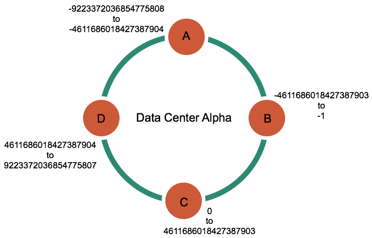

# Architecture

## Architecture in brief

Cassandra is designed to handle big data workloads across multiple nodes with no single point of failure. Its architecture is based on the understanding that system and hardware failures can and do occur. Cassandra addresses the problem of failures by employing a peer-to-peer distributed system across homogeneous nodes where data is distributed among all nodes in the cluster. **Each node frequently exchanges state information** about itself and other nodes across the cluster using **peer-to-peer gossip communication protocol**. A sequentially written commit log on each node captures write activity to ensure data durability. Data is then **indexed and written** to an in-memory structure, called a `memtable`, which resembles a write-back cache. Each time the memory structure is full, the data is written to disk in an SSTables data file. All writes are **automatically partitioned and replicated throughout the cluster**. Cassandra periodically consolidates SSTables using a process called **compaction**, discarding obsolete data marked for deletion with a tombstone. To ensure all data across the cluster stays consistent, various repair mechanisms are employed.

Typically, a cluster has one keyspace per application composed of many different tables.

Client read or write requests can be sent to any node in the cluster. When a client connects to a node with a request, that node serves as the `coordinator` for that particular client operation. The coordinator acts as a **proxy** between the client application and the nodes that own the data being requested. The coordinator **determines which nodes** in the ring should get the request based on how the cluster is configured.

## Internode communications (gossip)

A peer-to-peer communication protocol to **discover and share location** and state information about the other nodes in a Cassandra cluster. Gossip information is also **persisted locally by each node** to use immediately when a node restarts.

### Failure detection and recovery

Cassandra can also avoid routing requests to nodes that are alive, but performing poorly, through the `dynamic snitch`.

When a node comes back online after an outage, it may have **missed writes** for the replica data it maintains. Repair mechanisms exist to recover missed data, such as `hinted handoffs` and `manual repair with nodetool repair`. The length of the outage will determine which repair mechanism is used to make the data consistent.

## Data distribution and replication

In Cassandra, **data distribution** and **replication** `go together`. Data is organized by table and identified by a primary key, which determines which node the data is stored on. Replicas are copies of rows. When **data is first written**, it is also **referred** to as a **replica**.

Factors influencing replication include:

1. **Virtual nodes**: assigns data ownership to physical machines.
2. **Partitioner**: partitions the data across the cluster.
3. **Replication strategy**: determines the replicas for each row of data.
4. **Snitch**: defines the topology information that the replication strategy uses to place replicas.

### Consistent hashing

Consistent hashing allows distribution of data across a cluster to minimize reorganization when nodes are added or removed. Consistent hashing partitions data **based on the partition key**.

|Name|age|car|
|---|---|---|
|jim|36|camaro|
|carol|37|bmw|
|johnny|12||
|suzy|10||

|Node|Start range|End range|Partition key|Murmur3 hash value|
|---|---|---|---|---|
|A|-9223372036854775808|-4611686018427387904|johnny|-6723372854036780875|
|B|-4611686018427387903|-1|jim|-2245462676723223822|
|C|0|4611686018427387903|suzy|1168604627387940318|
|D|4611686018427387904|9223372036854775807|carol|7723358927203680754|

### Virtual nodes

Virtual nodes, known as Vnodes, distribute data across nodes at a **finer granularity** than can be easily **achieved** if calculated tokens are used. Vnodes simplify many tasks in Cassandra:

- **Tokens are automatically calculated** and **assigned** to each node.
- **Rebalancing a cluster is automatically accomplished** when adding or removing nodes. When a node joins the cluster, it assumes responsibility for an even portion of data from the other nodes in the cluster. If a node fails, the load is spread evenly across other nodes in the cluster.
- **Rebuilding a dead node** is faster because it involves every other node in the cluster.
- The **proportion of vnodes assigned** to each machine in a cluster can be assigned, so **smaller and larger** computers can be used in building a cluster.

#### How data is distributed across a cluster

Vnodes allow each node to own a **large number of small partition** ranges distributed throughout the cluster. Vnodes also use consistent hashing to distribute data but using them **doesn't require** token generation and assignment

意思是, 传统的环形hash, 会出现某个节点数据过大的问题, 原因是实际的node数不够多, 这时候可以使用vnode每个节点虚拟出多个vnode, 来增加节点的个数, 这样数据更平均的分散, 迁移变动也更小. 还可以设置vnode的个数为2的n次幂来加快计算.

### Data Replication

Two replication strategies are available:

- **SimpleStrategyv**: Use only for a **single datacenter** and **one rack**. SimpleStrategy places the first replica on a node determined by the partitioner. **Additional replicas are placed on the next nodes clockwise in the ring** without considering topology (rack or datacenter location).
- **NetworkTopologyStrategy**: Highly recommended for most deployments because it is much easier to expand to **multiple datacenters** when required by future expansion.

## Partitioners

A partitioner determines **which node** will receive the **first replica** of a piece of data, and how to distribute other replicas across other nodes in the cluster. Each row of data is **uniquely identified** by a primary key, which may be **the same as its partition key**, but which may also include other clustering columns. **A partitioner is a hash function** that derives a token from the primary key of a row. The partitioner uses the token value to **determine which nodes in the cluster receive** the replicas of that row. The Murmur3Partitioner is the default partitioning strategy for new Cassandra clusters and the right choice for new clusters in almost all cases.

You must set the partitioner and assign the node a num_tokens value for each node. The number of tokens you assign depends on the hardware capabilities of the system. If not using virtual nodes (vnodes), use the initial_token setting instead.

However, the partitioners are **not compatible** and data partitioned with one partitioner **cannot be easily converted to** the other partitioner.

- **Murmur3Partitioner (default)**: uniformly distributes data across the cluster based on MurmurHash hash values. **can be** used with vnodes. However, if you **don't use** vnodes, you **must calculate** the tokens
- **RandomPartitioner**: uniformly distributes data across the cluster based on MD5 hash values. **can be** used with virtual nodes (vnodes). However, if you **don't use** vnodes, you **must calculate** the tokens/
- **ByteOrderedPartitioner**: keeps an ordered distribution of data lexically by key bytes

> Note: If using **virtual nodes (vnodes)**, you **do not** need to calculate the tokens. If not using vnodes, you **must calculate** the tokens to assign to the initial_token parameter in the cassandra.yaml file

## Replica placement strategy

Cassandra stores copies (replicas) of data on multiple nodes to ensure reliability and fault tolerance. A replication strategy determines which nodes to place replicas on. The first replica of data is simply the first copy; it is not unique in any sense. The NetworkTopologyStrategy is highly recommended for most deployments because it is much easier to expand to multiple datacenters when required by future expansion.

When **creating a keyspace**, you **must defin** the replica placement strategy and the number of replicas you want.