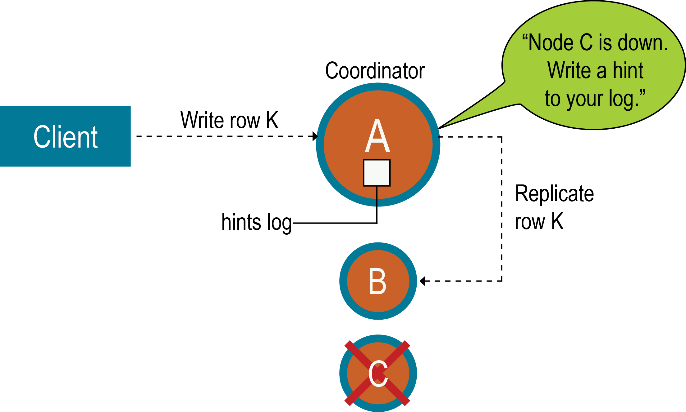

# Opertions

[Opertions](https://docs.datastax.com/en/cassandra/3.0/cassandra/operations/operationsTOC.html)

## Adding or removing nodes, datacenters, or clusters

### Adding nodes to an existing cluster

Virtual nodes (vnodes) greatly simplify adding nodes to an existing cluster:

- Calculating tokens and assigning them to each node is **no longer required**.
- Rebalancing a cluster is no longer necessary because a node joining the cluster assumes responsibility for **an even portion of the data**.

Use `nodetool status` to verify that the node is fully bootstrapped and all other nodes are up (UN) and not in any other state.
**After all new nodes** are `running`, run `nodetool cleanup` on each of **the previously existing nodes** to remove **the keys that no longer belong to those nodes**. **Wait for** cleanup to complete on one node before running nodetool cleanup on the **next node**.
Cleanup can be safely postponed for low-usage hours.

### Replacing a dead node or dead seed node

`nodetool -u cassandra -pw cassandra status`
`nodetool -u cassandra -pw cassandra ring`

## backup and restoring data

### snapshot

- Run nodetool cleanup to ensure that invalid replicas are removed.

```bash
nodetool cleanup [keyspace_name]
```

- Run the nodetool snapshot command add keyspace_name snapshot

```bash
# The snapshot is created in data_directory/keyspace_name/table_name-UUID/snapshots/snapshot_name directory. Each snapshot directory contains numerous .db files that contain the data at the time of the snapshot.
nodetool -h localhost -p 7199 snapshot [keyspace_name]
```

- To delete all snapshots for a node

```bash
nodetool -u cassandra -pw cassandra clearsnapshot [keyspace_name]
```

## Repairing nodes

Node repair corrects the inconsistencies so that eventually all nodes have the same and most up-to-date data. It is important **part of regular maintenance** for every Cassandra cluster.

### Hinted Handoff

If a node becomes **unable to receive** a particular write, the write's coordinator node **preserves** the data to be written as a set of **hints**. When the node **comes back online**, the coordinator effects repair by **handing off hints** so that the node can catch up with the required writes.

By design, **hinted handoff inherently** allows Cassandra to continue performing the same number of writes even when the cluster is operating at reduced capacity.

In Cassandra 3.0 and later, the hint is **stored in a local hints directory** on each node for improved replay. The hint consists of a **target ID for the downed node, a hint ID that is a time UUID for the data, a message ID that identifies the Cassandra version, and the data itself as a blob**. Hints are **flushed to disk every 10 seconds**, reducing the staleness of the hints. When gossip discovers when a node has comes back online, the coordinator replays **each remaining hint** to write the data to the newly-returned node, then **deletes the hint file**. If a node is down for longer than max_hint_window_in_ms (3 hours by default), the coordinator **stops writing** new hints.



意思是, 在写入时, 有某个节点挂了, cassandra会以降低副本量的操作继续执行写入. 但是会在所有节点的本地目录记录一个hints目录. 在有效期内node recover了, coordinator会回访所有的hints. 如果超过有效期, 就不再执行hints的写入了.

### Read Repair

During the read path, a **query assembles** data from several nodes. The coordinator node for this write compares the data from each replica node. If any replica node **has outdated data**, the coordinator node sends it the **most recent version**. The scope of this type of repair depends on the keyspace's replication factor. During a write, Cassandra collects only enough replica data to satisfy the replication factor, and only performs read repair on nodes that participate in that write operation.

In read repair, Cassandra sends a digest request to each replica not directly involved in the read. Cassandra compares all replicas and writes the most recent version to any replica node that does not have it. If the query's consistency level is **above ONE**, Cassandra performs this process on **all replica nodes** in the foreground before the data is returned to the client. Read repair repairs any node queried by the read. This means that for a consistency level of ONE, no data is repaired because no comparison takes place. For QUORUM, **only** the nodes that the query touches are repaired, **not all nodes**.

Read repair cannot be performed on tables that use DateTieredCompactionStrategy, due to the method of checking timestamps used in DTCS compaction. **If your table uses DateTieredCompactionStrategy, set read_repair_chance to `zero`**. For **other compaction** strategies, read_repair_chance is typically set to a value of **`0.2`**.

### Anti-Entropy Repair

Cassandra provides the nodetool repair tool to ensure data consistency across replicas; it compares the data across all replicas and then updates the data to the most recent version. Use nodetool repair as part of your regular maintenance routine.

> Warning: DataStax recommends stopping repair operations during topology changes; the Repair Service does this automatically. Repairs running during a topology change are likely to error when it involves moving ranges.

- Build a **Merkle tree** for `each` replica
- **Compare the Merkle trees** to discover `differences`

#### When to run anti-entropy repair

Run **incremental repair** `daily`, run **full repairs** `weekly to monthly`. Monthly is generally sufficient, but run more frequently if warranted