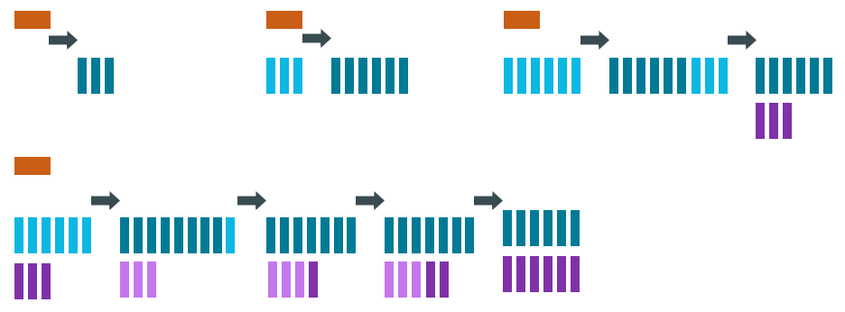
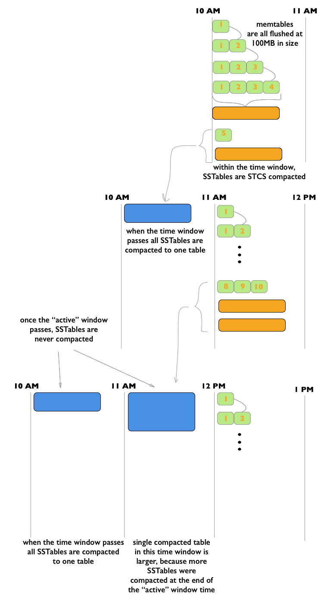
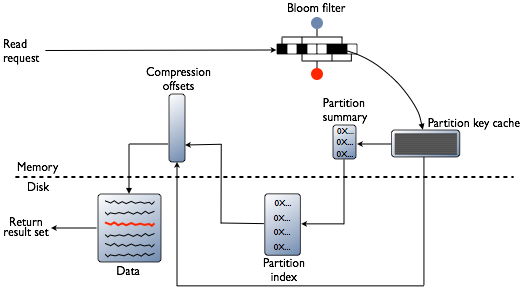
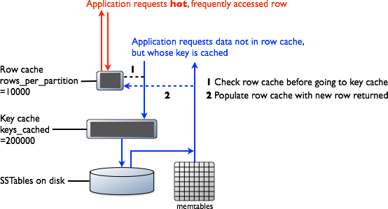

# How Cassandra reads and writes data

[How Cassandra reads and writes data](https://docs.datastax.com/en/cassandra/3.0/cassandra/dml/dmlHowDataWritten.html)

[cassandra的内部机制](https://www.jianshu.com/p/77eb257bf5dc)

Cassandra uses a storage structure similar to a **Log-Structured Merge Tree**, unlike a typical relational database that uses a B-Tree.

## How is data written

Cassandra processes data at several stages on the write path, starting with the immediate logging of a write and ending in with a write of data to disk:

- Logging data `in` the **commit log**
- Writing data `to` the **memtable**
- Flushing data `from` the **memtable**
- Storing data `on` disk in **SSTables**

### Logging writes and memtable storage

The `memtable` is a **write-back cache of data partitions** that Cassandra looks up **by key**. The memtable stores writes in **sorted order** until reaching a configurable limit, and then is flushed.

### Storing data on disk in SSTables

**Memtables and SSTables are maintained per table**. The commit log is **shared among** tables. SSTables are `immutable`, not written to again **after** the memtable is **flushed**. Consequently, `a partition` is typically stored **across multiple SSTable files**. A number of other SSTable structures exist to assist read operations:


## How is data maintained

The Cassandra write process stores data in files called SSTables. SSTables are immutable. Instead of overwriting existing rows with inserts or updates, Cassandra writes new timestamped versions of the inserted or updated data in new SSTables. Cassandra **does not perform deletes** by removing the deleted data: instead, Cassandra **marks it** with `tombstones`

To keep the database healthy, Cassandra periodically **merges SSTables and discards old data**. This process is called `compaction`.

### Compaction

Compaction works on **a collection of SSTables**. From these SSTables, compaction collects all versions of each unique row and assembles one complete row, using **the most up-to-date version** (by timestamp) of **each of the row's** `columns`. The merge process is **performant**, because **rows are sorted by partition key within each SSTable**, and the merge process **does not use** random I/O. The new versions of each row **is written to a new SSTable**. The old versions, along with any rows that are ready for deletion, are left in the old SSTables, and are deleted as soon as pending reads are completed.

Cassandra can read data **directly from the new SSTable** even **before it finishes writing**, instead of waiting for the entire compaction process to finish.

意思是, 合并是高效的. 原因是行是按通过分区key排序的, 合并时并不是随机I/O, 合并后的值写入新的 SSTable中, 在挂起的read完成后, 删除.

### Compaction strategies

#### SizeTieredCompactionStrategy (STCS)

Recommended for **write-intensive(写负载密集型)** workloads.

The SizeTieredCompactionStrategy (STCS) initiates compaction when Cassandra has accumulated a set number (default: 4) of similar-sized SSTables. STCS **merges these SSTables** into **one larger SSTable**. As these larger SSTables accumulate, STCS merges these into even larger SSTables. At any given time, several SSTables of varying sizes are present.

STCS **does not evict deleted data predictably** because its trigger for compaction is SSTable size, and SSTables might **not grow quickly enough to merge and evict old data**. As the largest SSTables grow in size, the amount of disk space needed for both the new and old SSTables simultaneously during STCS compaction can **outstrip a typical amount of disk space** on a node.

意思是, 当达到一定大小时, 会合并4个SSTables成为一个. 由于是按照大小分组, 数据没有规则的在不同的SSTable中, 没法预测性的**触发**做删除合并. 即使有很多垃圾数据也不行. 而且在最大的SSTable做合并的时候, 可能磁盘上已经没有容量存放数据了, 无法合并.

#### LeveledCompactionStrategy (LCS)

Recommended for **read-intensive(读密集型)** workloads.

The LeveledCompactionStrategy (LCS) alleviates some of the read operation issues with STCS. This strategy works with **a series of levels**. First, data in memtables is **flushed to** SSTables in **the first level (L0)**. LCS **compaction merges** these `first` SSTables with `larger` SSTables in **level L1**.



In each of the levels above L0, LCS **creates SSTables** that are about **the same size**. Each level is 10X the size of the last level, so level L1 has 10X as many SSTables as L0, and level L2 has 100X as many. If the result of the compaction is more than 10 SSTables in level L1, the excess SSTables are moved to level L2.

The LCS compaction process guarantees that the SSTables within each level starting with **L1 have non-overlapping data**. For many reads, this process enables Cassandra to retrieve all the required data from only one or two SSTables. In fact, 90% of all reads can be satisfied from one SSTable. Since LCS does not compact L0 tables, however, resource-intensive reads involving many L0 SSTables may still occur.

At levels beyond L0, LCS requires less disk space for compacting — generally, 10X the fixed size of the SSTable. Obsolete data is evicted more often, so deleted data uses smaller portions of the SSTables on disk. 

意思是, L层级之间都是10倍差距, 新刷如L0的数据, 会与L1层级更大的SSTable做合并. 从L1层级开始, 就**不再有重复数据**了. 这样, 大量的读都只需要在1/2个SSTable就能命中(90%). 但是L0层还是会被频繁的读, 因为没有在这层做合并. 很显然, 超过L0层的合并, 需要删除的数据只会占用少量空间, 因为**绝大多数的多余数据在前一层合并时已经被删除**了. 此策略的问题是, 会频繁的合并, 导致I/O经常是满的.

#### TimeWindowCompactionStrategy (TWCS)

Recommended for **time series and expiring TTL(时间序列和正在过期的TTL)** workloads.(意思是, 在段时间内的数据是比较集中被更新的, 超过时间的数据很少被更新, 就可以做合并了, 时间是有序的TTL, 增长的)

**During compaction**, TWCS **applies STCS to uncompacted SSTables** in **the most recent time window**. At the end of a time window, TWCS compacts **all SSTables** that fall into that time window **into a single** SSTable based on the **SSTable maximum timestamp**. Once the major compaction for a time window is completed, no further compaction of the data will ever occur. The process **starts over** with the SSTables written in **the next time window**.



意思是, 在时间窗口期间, 使用STCS策略来**压缩**善未压缩的SSTables. 在时间窗口结束时, 将时间窗口期间**所有的SSTables**按照其内的**最大timestamp**压缩成**一个**SSTables. 后续不再压缩. 直到下一个时间窗口开始

> **时间序列数据**, 图像/视频流的采集以及对应的特征数据, 非常符合这个定义. 都是**有时间标识**, **数据基本都是append**, 关心的都是**最近的数据**

#### DateTieredCompactionStrategy (DTCS)

### Which compaction strategy is best

``` text
1. Does your table process time series data?
    If so, your best choices are TWCS or DTCS
```

## How is data updated

Cassandra treats each new row as an `upsert`: if the new row has **the same primary key** as that of an existing row, Cassandra processes it as an **update** to the existing row.

Periodically, the rows stored in memory are streamed to disk into structures called SSTables. At certain intervals, Cassandra **compacts smaller SSTables into larger SSTables**. If Cassandra encounters two or more versions of the same row during this process, Cassandra **only writes the most recent version** to the **new SSTable**. After compaction, Cassandra **drops the original SSTables, deleting the outdated rows**.

Most Cassandra installations store replicas of each row on two or more nodes. Each node performs compaction independently. This means that even though out-of-date versions of a row have been dropped from one node, they may still exist on another node.

This is why Cassandra performs another **round of comparisons during a read process**. When a client requests data with a particular primary key, Cassandra retrieves many versions of the row from one or more replicas. The version with the most recent timestamp is the only one returned to the client ("last-write-wins").

> Note: Some database operations may **only write partial updates of a row**, so some versions of a row may include some columns, but not all. During a compaction or write, Cassandra assembles a complete version of **each row** from the partial updates, using the most recent version of each **column**.

意思是, 提供的是upsert, 基于多版本的插入, 使用compaction机制来删除本地多余过期的数据. 由于是分布式的, 可能在其他node还是有旧的节点. 在read的时候做comparison比较, 取最新的. Cassandra采用的合并策略是基于**每行数据的每列**进行更新

## How is data deleted

Cassandra treats a delete as an insert or upsert. The data **being added to the partition** in the DELETE command is a **deletion marker** called a tombstone. The tombstones go through Cassandra's write path, and are written to SSTables on one or more nodes. The key difference feature of a tombstone: it has a built-in expiration date/time. the tombstone is deleted as part of Cassandra's **normal compaction process**.

### Deletion in a distributed system

If a node receives a delete for data it stores locally, the node tombstones the specified record and tries to **pass the tombstone to other nodes** containing replicas of that record. **But if** one replica node is **unresponsive** at that time, it does not receive the tombstone immediately, so it still contains the pre-delete version of the record. If the tombstoned record has already been deleted from **the rest of the cluster** `befor` that node **recovers**, Cassandra treats **the record on the recovered node as new data**, and propagates it to the rest of the cluster. This kind of deleted but persistent record is called a **zombie**.

To prevent the reappearance of zombies, the database gives **each tombstone** a **grace period(宽限期)**. The purpose of the grace period is to give unresponsive nodes time to recover and process tombstones normally. When multiple replica answers are part of a read request, and those responses differ, then whichever values are most recent take precedence. For example, if a node has a tombstone but another node has a more recent change, then the final result includes the more recent change.

When an unresponsive node recovers, Cassandra uses `hinted` **handoff to replay the database mutations the node missed while it was down**. Cassandra **does not replay** a mutation for a tombstoned record during its grace period. But if the node **does not recover** until after **the grace period ends**, Cassandra may **miss the deletion**.

意思是, 由于是分布式系统, 删除一个节点的时候, 需要通知其他节点也删除. 但是如果有一个节点挂了, 没有收到这个命令. 一直到其他节点已经执行了删除数据, 这个节点才恢复, 那么就会把本应该删除的数据恢复, 就像僵尸一样数据过一段时间复活了. 解决方案是使用一个`grace period=10天`, 在宽限期内, 恢复的节点要运行`hinted`文件来做恢复动作. 在`grace period`期间内, 会忽略被设置`tombstoned`的数据. 超过这个限制, 就会成为一个zombie

## How are indexes stored and updated

Secondary indexes can be built for a column in a table. These indexes are stored locally on each node in a **hidden table** and built in a background process. If a secondary index is used in a query that is **not restricted** to a **particular partition key**, the query will have prohibitive read latency because **all nodes** will be queried. A query with these parameters is only allowed if the query option ALLOW FILTERING is used. This option is not appropriate for production environments. If a query includes both a partition key condition and a secondary index column condition, the query will be successful because the query can be directed to a single node partition.

有内置的二级索引，存放在本地node的一个隐藏表内，由后台进程来维护。就算已经建立来二级索引，但是如果查询的时候没有指定partition的话，查询会所有的节点发出，这样的话会很耗时.

所以搜索的时候要带上partition key，指定在哪个partition里做二级索引的搜索

二级索引的使用要谨慎，例如按年龄来排序的时候（年龄不在主键上），更好的方法是使用materialized view或者additional table that is ordered by age

## How is data read

Cassandra processes data at several stages on the read path to discover where the data is stored, starting with the data in the memtable and finishing with SSTables:

1. Check the memtable
2. Check row cache, if enabled
3. Checks Bloom filter
4. Checks partition key cache, if enabled
5. Goes directly to the compression offset map if a partition key is found in the partition key cache, or checks the partition summary if not, If the partition summary is checked, then the partition index is accessed
6. Locates the data on disk using the compression offset map
7. Fetches the data from the SSTable on disk




### Memtable

If the memtable has the desired partition data, then the data is read and then merged with the data from the SSTables.

### Row Cache

The row cache, if enabled, **stores a subset** of the partition data stored on disk in the SSTables in memory. In **Cassandra 2.2 and later**, it is stored in **fully off-heap memory** using a new implementation that relieves garbage collection pressure in the JVM. The subset stored in the row cache use a configurable amount of memory for a specified period of time. The row cache uses **LRU (least-recently-used)** eviction to reclaim memory when the cache has **filled up**.

If row cache is enabled, desired partition data is read from the row cache, potentially **saving two seeks** to disk for the data. The rows stored in row cache are frequently accessed rows that are merged and saved to the row cache from the SSTables as they are accessed. **After storage**, the data is available to later queries. The row cache is **not write-through**. If a **write comes** in for the row, the cache for that row is **invalidated** and is **not cached again**until the row is read. Similarly, if a **partition is updated**, the entire partition is **evicted** from the cache. When the desired partition data is not found in the row cache, then the Bloom filter is checked.

意思是, row cache是通过分区数据的SSTable的子集保存在memory上. 并且从2.2版本以后, 这个缓存使用了jvm外的page cache进行缓存(以便减少heap的压力). 在数据被保存后, cache是不能变更的. 如果有新的数据写入. 这行数据在row cache不可读直到下一次read. 如果partition被更新, 则整个数据都会从cache中删除.

### Bloom Filter

The Bloom filter is **stored in off-heap memory**. Each SSTable has a Bloom filter associated with it. A Bloom filter can **establish** that a SSTable **does not contain certain** partition data. A Bloom filter can also find the **likelihood** that partition data is stored in a SSTable. It speeds up the process of partition key lookup by narrowing(缩小) the pool of keys. However, because the Bloom filter is a probabilistic(概率) function, it can result in false positives. Not all SSTables identified by the Bloom filter will have data. If the Bloom filter does not rule out an SSTable, Cassandra checks the partition key cache

The Bloom filter grows to approximately **1-2 GB per billion partitions**. In the extreme case, you can have one partition per row, so you can easily have billions of these entries on a single machine. The Bloom filter is tunable if you want to trade memory for performance.

意思是, bloom filter是一个概率函数(如果认为不存在, 还需要走partition key cache), 能确定2个事情, 1. 数据**不在**parition data上, 2. 数据**可能**在partition上的**概率**. 这个方法可以快速缩小key池在partition的范围.

### Partition Key Cache

The partition key cache, if enabled, stores a cache of the partition index in **off-heap memory**. The key cache uses a small, configurable amount of memory, and **each "hit" saves one seek during the read operation**. If a partition key is found in the key cache can go directly to the compression offset map to find the compressed block on disk that has the data. The partition key cache functions **better once warmed**, and can greatly improve over the performance of cold-start reads, where the key cache doesn't yet have or has purged the keys stored in the key cache. It is possible to limit the number of partition keys saved in the key cache, if memory is very limited on a node. If a partition key is not found in the key cache, then the partition summary is searched.

The partition key cache size is configurable, as are the number of partition keys to store in the key cache.

意思是, 使用堆外缓存, 每个被读取命中一次的key进行缓存.

### Partition Summary

The partition summary is an **off-heap in-memory** structure that stores **a sampling of the partition index**. **A partition index contains all partition keys**, whereas a partition summary samples every X keys, and maps the location of every Xth key's location in the index file. For example, if the partition summary is set to sample every 20 keys, it will store the location of the first key as the beginning of the SSTable file, the 20th key and its location in the file, and so on. While not as exact as knowing the location of the partition key, the partition summary can shorten the scan to find the partition data location. After finding the range of possible partition key values, the partition index is searched.

By configuring the sample frequency, you can trade memory for performance, as the more granularity the partition summary has, the more memory it will use. The sample frequency is changed using the index interval property in the table definition. A fixed amount of memory is configurable using the index_summary_capacity_in_mb property, and defaults to 5% of the heap size

### Partition Index

The partition index resides on disk and stores an index of all partition keys mapped to their offset. If the partition summary has been checked for a range of partition keys, now the search passes to the partition index to seek the location of the desired partition key. A single seek and sequential read of the columns over the passed-in range is performed. Using the information found, the partition index now goes to the compression offset map to find the compressed block on disk that has the data. If the **partition index must be searched, two seeks** to disk will be required to find the desired data.

意思是, partition index是保存在磁盘上的, 通过offset来定位. 如果在 partition summary获取到范围, 需要通过一个顺序的读seek来获取到index, 然后再通过一个seek去compression offset map超找到数据(需要2次磁盘seek)

### Compression offset map

The **compression offset map** stores pointers to **the exact location** on disk that **the desired partition data** will be found. It is stored in **off-heap memory** and is accessed by either the partition key cache or the partition index. The desired compressed partition data is fetched from the correct SSTable(s) once the compression offset map identifies the disk location. The query receives the result set.

> Note: Within a partition, all rows are not equally expensive to query. The very beginning of the partition (the first rows, clustered by your key definition) is slightly less expensive to query because there is no need to consult the partition-level index.

The compression offset map grows to **1-3 GB** `per terabyte` compressed. The more you compress data, the greater number of compressed blocks you have and the larger the compression offset table. Compression is enabled by default even though going through the compression offset map consumes CPU resources. Having compression enabled makes the page cache more effective, and typically, almost always pays off.

意思是, compression offset map可以准确的定位到预期的partition data在磁盘的什么位置. **每1TB的数据被压缩, 就会产生1-3GB的压缩偏移表**.