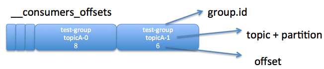
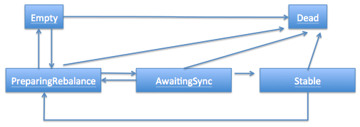

# consumer group

[Kafka消费组(consumer group)](https://www.cnblogs.com/huxi2b/p/6223228.html)

consumer group是kafka提供的可扩展且具有**容错性的消费者机制**

1. consumer group下可以有一个或多个consumer instance, consumer instance可以是一个进程, 也可以是一个线程
2. group.id是一个字符串, 唯一标识一个consumer group
3. consumer group下订阅的topic下的每个分区只能分配给某个group下的一个consumer(当然该分区还可以被分配给其他group)

## 工具

```bash
# 查看 制定消费组 offsets 情况
./kafka-consumer-groups.sh --describe --bootstrap-server 172.20.25.100:9092 --group fdb-consumer-g1 --offsets
```

> **Note** that there's **no need to delete group metadata** for the **new consumer** as it is **automatically deleted** when **the last member leaves**, 消费组元数据, 会定期删除

## poll

在poll()时会判断**是否需要更新元数据**。客户端调用元数据更新器的maybeUpdate()方法, 并不一定每次都需要更新元数据。只有当元数据的超时时间（metadataTimeout）等于0时, 客户端才会发送元数据请求

元数据对象的每个方法都加上了`synchronized`关键字, 即使有多个客户端线程（用户线程）使用同一个生产者示例, 并且访问相同的元数据对象, 也是**线程安全**的

## offset

每个**consumer group**保存**自己的位移**信息, 那么只需要简单的一个整数表示位置就够了, 同时可以引入checkpoint机制定期持久化. `kafka broker` 会**定期**把group消费情况**保存**起来, 做成一个 `offset map`

每个 consumer group 连接上来, 有3个 offset可供选择

1. `OffsetNewest`, 读取的consume msg从记录的**当前offset**位置开始往后的值开始消费.
2. `OffsetOldest`, 每次都从**初始offset**开始消费
3. `NextOffset()`, 每次从几路的**当前offset**位置开始消费

**生产环境**, 一般是用1,3. **开发环境**, 会用2.

1. **老版本**的kafka, 使用 ConsumerConnector, 配置zookeeper.connect 来消费. 每个consumer group offset 在 zk 的 `/consumers/{group_id}/`下记录**当前offset**的位置.
2. **新版本**的kafka, 使用 kafkaConsumer, 配置 bootstrap.servers 来消费. 消费者的offset会更新到一个kafka **自带的topic** `__consumer_offsets`下面. __consumers_offsets topic配置了**compact**策略, 使得它总是能够保存最新的位移信息, 既控制了该topic总体的日志容量, 也能实现保存最新offset的目的.
   1. 默认情况下有topic __consumers_offsets 有50个 partition, 每个 partition 三replica.
   2. group 的消费情况要存储到哪一个 partition 上, 是根据 `abs(GroupId.hashCode()) % NumPartitions` 来计算（其中, NumPartitions 是__consumer_offsets 的 partition 数, 默认是50个）

> **虽然Partition是以消费者级别被消费的, 不过Partition的消费进度要保存成消费组级别**




Last Committed Offset 和 Current Position 是与 **Consumer Client** 有关

High Watermark 和 Log End Offset 与 **Producer Client** 数据写入和 replica 之间的数据同步有关

- **Last Committed Offset**: 这是 group 最新一次 commit 的 offset, 表示这个 group 已经把 Last Committed Offset 之前的数据都消费成功了
- **ConsumerOffset/Current Position**: group 当前消费数据的 offset, 也就是说, Last Committed Offset 到 Current Position 之间的数据已经拉取成功, 可能正在处理, 但是还未 commit
- **Log End Offset**: producer 写入到 kafka 中的最新一条数据的 offset, LogEndOffset的缩写, 表示每个`partition`的log**最后一条**Message的位置(**保存在内存中**)
- **High Watermark**: 是指`consumer`能够看到的此partition的位置, 一个partition中的ISR列表中, leader的HW是所有ISR列表里副本中**最小**的那个的LEO. 已经成功备份到其他 replicas 中的最新一条数据的 offset. Log End Offset 与 High Watermark 之间的数据已经写入到该 partition 的 leader 中, 但是还未成功备份到其他的 replicas 中, 这部分数据被认为是不安全的, 是不允许 Consumer 消费的(**保存在内存中**)

[high watermark](https://www.cnblogs.com/huxi2b/p/7453543.html)

follower发送过来的FETCH请求因为**无数据**而暂时会被寄存到leader端的`purgatory(延迟操作, 如何唤醒? todo)`中, 待500ms(replica.fetch.wait.max.ms参数)超时后会**强制完成**. 倘若在寄存**期间**producer端发送过来数据, 那么会Kafka会自动**唤醒**该FETCH请求, 让leader继续处理之

HW **不能**作为衡量副本备份成功的标准, 需要引入 `[epoch, offset]` 才能解释. 由于这个**高水位延迟一轮**, 在一些情况下, kafka会出现丢数据和主备数据不一致的情况, 0.11开始, 使用`leader epoch`来代替高水位

### sarama-cluster

在启动时, 会做rebalance, 给所有的consumer分配对应的partition, 当rebalance完成后, 才会开始consume. 这里会有个delay.

- **OffsetNewest**, 从consumer启动完成后标记的offset的数据进行消费. 在consumer启动前没人消费的数据, 也不做消费
- **OffsetOldest**, 从offset记录的最后位置 开始消费. 这些数据可能在consumer启动前没有人消费, 这时候consumer也会消费.

### commit

消费者每次消费后, 有2种方式修改 offset

1. 自动提交, 设置"enable.auto.commit", 为"true"即可
2. 手动提交
   1. **提交所有订阅的topic**, 直接在每次消费完成之后调用`consumer.commitSync()`
   2. **单独提交一个topic的partition**, 调用形式`consumer.commitSync(Collections.singletonMap(partition, new OffsetAndMetadata(lastOffset + 1))`, 这种提交更精确

## rebalance

rebalance本质上是一种协议, 规定了一个consumer group下的所有consumer如何达成一致来分配订阅topic的每个分区。比如某个group下有20个consumer, 它订阅了一个具有100个分区的topic。正常情况下, Kafka平均会为每个consumer分配5个分区。这个分配的过程就叫rebalance

### rebalance 的时机

1. 组成员发生变更(新consumer加入组、已有consumer主动离开组或已有consumer崩溃了——这两者的区别后面会谈到)
2. 订阅主题数发生变更——这当然是可能的, 如果你使用了正则表达式的方式进行订阅, 那么新建匹配正则表达式的topic就会触发rebalance
3. 订阅主题的分区数发生变更

### rebalance 如何分配

kafka主动触发, consumer默认提供了两种分配策略：**range**和**round-robin**

### 协议

rebalance本质上是一组协议。group与coordinator共同使用它来完成group的rebalance。目前kafka提供了5个协议来处理与consumer group coordination相关的问题：

1. **Heartbeat**请求：consumer需要定期给coordinator发送心跳来表明自己还活着
   1. consumer如何向coordinator证明自己还活着？ 通过**定时**向coordinator发送`Heartbeat`请求。一旦coordinator认为某个consumer挂了, 那么它就会开启**新一轮rebalance**, 并且在当前其他consumer的`心跳response`中添加**REBALANCE_IN_PROGRESS**, 告诉其他consumer：不好意思各位, 你们重新申请加入组吧！
2. **LeaveGroup**请求：主动告诉coordinator我要离开consumer group
3. **JoinGroup**请求：成员请求加入组
   1. 这一步中, 所有成员都向coordinator发送JoinGroup请求, 请求入组。一旦所有成员都发送了JoinGroup请求, `coordinator`会从中**选择**`一个consumer`担任`leader`的角色, 并把组成员信息以及订阅信息发给leader --- 注意leader和coordinator不是一个概念。`consumer leader`负责**消费分配方案的制定**
4. **SyncGroup**请求：group leader把分配方案告诉组内所有成员
   1. 这一步`consumer leader`开始**分配消费方案**, 即哪个consumer负责消费哪些topic的哪些partition。一旦完成分配, `consumer leader`会将这个方案封**装进SyncGroup请求**中**发给coordinator**, 非leader也会发SyncGroup请求, 只是内容为空。`coordinator`**接收到分配方案**之后会把方案塞进SyncGroup的`response`中发给各个consumer。这样组内的所有成员就都知道自己应该消费哪些分区了(**Note: consumer group的分区分配方案是在客户端执行的**)
5. **DescribeGroup**请求：显示组的所有信息, 包括成员信息, 协议名称, 分配方案, 订阅信息等。通常该请求是给管理员使用

Coordinator在rebalance的时候主要用到了前面4种请求

## group coordinator

使用 group coordinator 进行 **组管理** 和 **位移管理**. consumer group的**consumer**启动的时候, 它会去和kafka server确定谁是它们的**group coordinator**。之后该group内的**所有成员**都会和该group coordinator进行**协调通信**。

确定group coordinator的方式:

- 确定consumer group位移信息写入__consumers_offsets的哪个分区. 具体计算公式：

> __consumers_offsets partition# = Math.abs(groupId.hashCode() % groupMetadataTopicPartitionCount)   注意：groupMetadataTopicPartitionCount由offsets.topic.num.partitions指定, 默认是50个分区。

- 该**分区(group在__consumer_offsets哪个分区) leader**所在的broker就是被选定的group coordinator, GroupCoordinator 会存储与该 group 相关的所有的 metadata

## group 状态机



- Dead: 组内已经没有任何成员的最终状态, 组的元数据也已经被coordinator移除了。这种状态响应各种请求都是一个response： UNKNOWN_MEMBER_ID
- Empty: 组内无成员, 但是位移信息还没有过期。这种状态只能响应JoinGroup请求
- PreparingRebalance: 组准备开启新的rebalance, 等待成员加入
- AwaitingSync: 正在等待leader consumer将分配方案传给各个成员
- Stable: rebalance完成！可以开始消费了~

状态机的规则和一些结论如下:

1. 第一个调用addMemberAndRebalance或者updateMemberAndRebalance的会将状态改为PreparingRebalance, 并且负责生成DelayedJoin
2. 一旦状态进入PreparingRebalance, 其他消费者就只能从PreparingRebalance状态入口进入, 这里只有两种选择addMemberAndRebalance或者updateMemberAndRebalance, 不过他们不会更改状态, 也不会生成DelayedJoin
3. 发生`DelayedJoin(AwaitingSync)`之后, 其他消费者的JoinGroup响应都会被延迟, 因为如规则2中, 他们只能调用add或update, 无法立即调用responseCallback, 所以就要和DelayedJoin的那个消费者一起等待
4. 正常流程时, 发生responseCallback的是存在成员编号的消费者在Leader之前发送了JoinGroup, 或者新增加的消费者发送了JoinGroup请求之前
5. 第一次Rebalance时, 第一个消费者会创建DelayedJoin, 之后的Rebalance, 只有新增的消费者才有机会创建（如果他在Leader之前发送的话, 如果在Leader之后就没有机会了）, 而普通消费者总是没有机会创建DelayedJoin的, 因为状态为Stable时, 他会直接开溜, 有人（Leader或者新增加的消费者）创建了DelayedJoin之后, 他又在那边怨天尤人只能等待

## consumer group 流程

> consumer 先获取 `metadata`, 以及对应的 `controller/coordinator`, 根据 memberId 做 rebalance, 根据获取的 `topic-partitions` 做 `subscribe` 进行 poll(). 通过监听 heartbeat 来决定是否需要 rebalance(关闭所有的partition consumer, 重建连接).

1. 当 `client` 启动的时候, 以 **第一个** broker 去获取集群 `metadata`, 根据metadata的brokers进行注册.(这里会有一个问题, brokers metadata保存的 addr 是服务器内部的 hostname), 并且将此 broker 作为 **controller**. 初始化更新集群 **topics-partitions**, 并做[all/write]两类caches
2. **broker**提供了一个**接口**, 获取这个**groupId**对应的 `coordinator`
3. 启动notification后, 当有rebalance的时候, 会发送 `notify(map[topic][partitons])`
4. `rebalance()`
   1. **更新**集群 metadata, 获取所有的 topics
   2. **关闭**所有 partitionConsumer
      1. **提交** offset, 由于有些数据只是写到了pageCache, 存在dirty data, 这个partition会标识为**dirty**, 在`commit offset`的时候需要带上标记
      2. **标记** topic下的partition新的commit offset是否还存在**dirty**
      3. **清除** 所有 partitionConsumer 缓存
   3. **重连join** 重新加入group
      1. 传入 memberId(初始为"") 和 groupId
      2. **broker**提供了一个**接口**, 加入新的member
      3. 返回 **memberId/generationId**, 根据是否是 leaderId 来获取 **balancer strategy(`range/roundBin`)**. *对所有的topic下的所有每个member分配了几个partition做一个统计*.
   4. **同步sync** group获取新的member分配 topic下的partition
      1. 根据 balancer strategy组合出 `map[memberId][topics][partitions]`
      2. 请求 **broker** 获取新的分配
      3. 如果 sync **失败**, 主动发送 **leave group**
5. `subscribe()`
   1. 根据 `map[topic][partitions]` 获取当前所有partition对应的**block**下的**offset**(一个partition的数据处于一个block)
   2. 给每一个 topic 下的 partition 创建一个 **partitionConsumer**
      1. 分配到的 partitionId, 正常都是这个 partition 的 **leader broker**, 并且创建 **leader broker** `dial`
      2. 根据用户选择的 `OffsetNewest`/`OffsetOldest` 获取具体的offset.(**samara v2.1.8**这里居然要请求两次...坑)
      3. 创建 `map[topic][partitionId][partitionConsumer]` 映射
      4. 根据**consumer partition**对应的 **leader broker**, 创建一个 **broker consumer**, 完成**初次有效通信**
         1. **订阅manager**, 完成 **初始化/管理** partitionConsumer
         2. **订阅consumer**, 一个 broker 可以对应多个 partitionConsumer
            1. 每加入一个 partitionConsumer, 都要 fetch 一次 msg
            2. 任何异常, 都把 **异常的partitionConsumer** 删除
      5. 对 **consumer partition** 完成 `messages/errors` channel
6. `heartbeat()`, 当 broker 出现 partitionConsumer变更的时候, 会返回 **ErrRebalanceInProgress()** 异常, 意思是 rebalance()
7. timer 定时提交 commit offset
