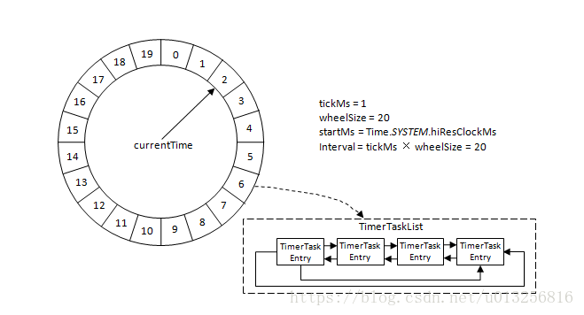
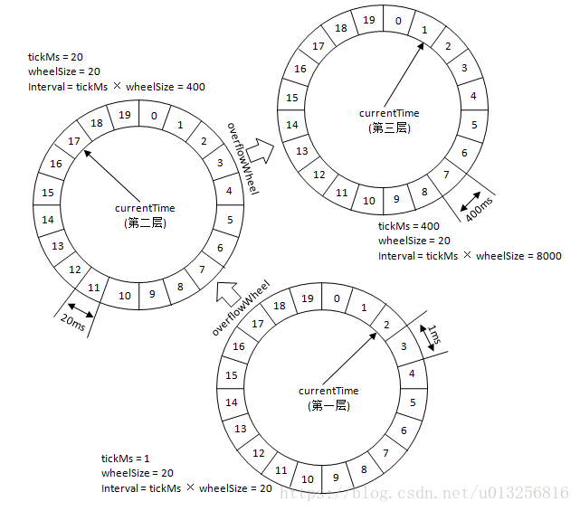
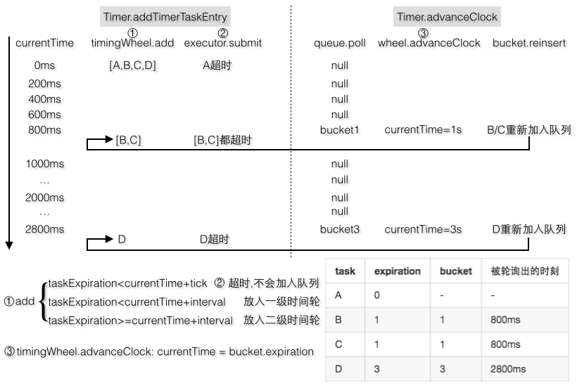

# deplay queue

[MQ支持任意延迟队列](https://www.cnblogs.com/hzmark/p/mq-delay-msg.html)
[了解延迟队列](https://juejin.im/post/5b5e52ecf265da0f716c3203)

## 应用场景

- 关闭空闲连接。服务器中，有很多客户端的连接，空闲一段时间之后需要关闭之。
- 清理过期数据业务上。比如缓存中的对象，超过了空闲时间，需要从缓存中移出。
- 任务超时处理。在网络协议滑动窗口请求应答式交互时，处理超时未响应的请求。
- 下单之后如果三十分钟之内没有付款就自动取消订单。
- 订餐通知:下单成功后60s之后给用户发送短信通知。
- 当订单一直处于未支付状态时，如何及时的关闭订单，并退还库存？
- 如何定期检查处于退款状态的订单是否已经退款成功？
- 新创建店铺，N天内没有上传商品，系统如何知道该信息，并发送激活短信？
- 定时任务调度: 使用DelayQueue保存当天将会执行的任务和执行时间，一旦从DelayQueue中获取到任务就开始执行

## 难点

- **排序**, 比如用户**先**发了一条延迟**1分钟**的消息，一秒**后**发了一条延迟**3秒**的消息，显然延迟**3秒**的消息需要**先**被投递出去。那么服务端在收到消息后需要对消息进行排序后再投递出去. 在MQ中, 为了保证可靠性, 消息是需要顺序落盘的, 且对性能和延迟的要求, 决定了在**服务端**对消息进行**排序**是完全**不可接受**的

- **存储**, 目前MQ的方案中都是基于**WAL**的方式实现的（RocketMQ、Kafka）, 日志文件会被过期**删除**, 一般会保留最近一段时间的数据。支持任意级别的延迟, 那么需要保存最近30天的消息, 存储hold不住.

## 原理

## 实现方式

### 轮询

特点：定期轮训数据库，设置**状态**

优点：实现简单

缺点：数据量过大时会消耗太多的IO资源，效率太低

### DelayQueue

特点： 无界、延迟、阻塞队列

优点: 读取时间`O(1)`

缺点: 插入和删除操作的平均时间复杂度为 `O(nlog(n))`, 如果有一个正在等待的长时间, 又加入了一个更短的等待时间, 无法做变更

> a. BlockingQueue+PriorityQueue（堆排序）+Delayed
> b. DelayQueue中存放的对象需要实现compareTo()方法和getDelay()方法。
> c. getDelay方法返回该元素距离失效还剩余的时间，当<=0时元素就失效了，就可以从队列中获取到。

`添加元素(带延迟时间) -> 按延迟时间排序 -> 出队列: 最先过期的元素出`

如果不使用 leader-follower 模式

1. 假设取值时，延时时间还没有到，那么需要等待，但这个时候，队列中新加入了一个延时更短的，并放在了队首，那么此时，for循环由开始了，取得是新加入的元素，那之前的等待就白等了，明显可以早点退出等待
2. 还有就是如果好多线程都在此等待，如果时间到了，同时好多线程会充等待队列进入锁池中，去竞争锁资源，但结果只能是一个成功，多了写无畏的竞争！（多次的等待和唤醒）

### Timer与TimerTask

插入和删除操作的平均时间复杂度为 `O(nlog(n))`

timer 和 scheduledExecutorService 共同的**缺点**, **不能指定绝对时间**, 无法支持高可用, 没有持久话数据

### TimingWheel 时间轮 (kafka/netty)

[Kafka解惑之时间轮（TimingWheel）](https://blog.csdn.net/u013256816/article/details/80697456)
[简单说说Kafka中的时间轮算法](https://juejin.im/entry/5bd975a1e51d453189120305)
[Kafka技术内幕样章 层级时间轮](https://segmentfault.com/a/1190000005348993)

底层还是基于DelayedQueue实现的, 因为DelayedOperation**数量级太大**了，可以将多个DelayedOperation组成一个TimerTaskList链表（在同一个列表中的所有任务的失效时间都很相近，但不一定都相等），以`TimerTaskList`作为**队列的元素**，所以失效时间会被设置到TimerTaskList上，当失效的时候，整个列表中的所有任务都会一起失效

插入和删除操作的时间复杂度都降为 `O(1)`, 支持的延迟精度为**毫秒(ms)**, 这里如果简单的用数组来存放, 要**消耗 亿亿级别的存储空间 Task[1540381425000]**.

Kafka中的时间轮（TimingWheel）是一个**存储定时任务**的**环形队列**, 底层采用数组实现，数组中的每个元素可以存放一个**定时任务列表（TimerTaskList）**。TimerTaskList是一个环形的**双向链表**，链表中的每一项表示的都是**定时任务项（TimerTaskEntry）**，其中封装了真正的定时任务TimerTask

每个时间格代表当前时间轮的**基本时间跨度（tickMs）**。时间轮的**时间格个数**是固定的，可用**wheelSize**来表示，那么整个时间轮的**总体时间跨度（interval）** = `tickMs × wheelSize` 计算得出。时间轮还有一个**表盘指针（currentTime）**，用来表示时间轮当前所处的时间，currentTime是tickMs的整数倍。currentTime可以将整个时间轮划分为到期部分和未到期部分，currentTime**当前指向**的时间格也属于**到期部分**，表示刚好到期，需要处理此时间格所对应的TimerTaskList的所有任务。当任务的到期时间超过了当前时间轮所表示的时间范围时，就会尝试添加到**上层时间轮**. (**高层次不具备执行能力, 只是存储熟悉**)

对于之前所说的350ms的定时任务，显然第一层时间轮不能满足条件，所以就升级到第二层时间轮中，最终被插入到第二层时间轮中时间格17所对应的TimerTaskList中。如果此时又有一个定时为450ms的任务，那么显然第二层时间轮也无法满足条件，所以又升级到第三层时间轮中，最终被插入到第三层时间轮中时间格1的TimerTaskList中。注意到在到期时间在[400ms,800ms)区间的多个任务（比如446ms、455ms以及473ms的定时任务）都会被放入到第三层时间轮的时间格1中，时间格1对应的TimerTaskList的超时时间为400ms。

**随着时间的流逝**，当次TimerTaskList到期之时，原本定时为450ms的任务还**剩下50ms**的时间，还不能执行这个任务的到期操作。这里就有一个时间轮**降级**的操作，会将这个剩余时间为50ms的定时任务重新提交到层级时间轮中，此时第一层时间轮的总体时间跨度不够，而第二层足够，所以该任务被放到第二层时间轮到期时间为[40ms,60ms)的时间格中。再经历了40ms之后，此时这个任务又被“察觉”到，不过还剩余10ms，还是不能立即执行到期操作。所以还要再有一次时间轮的降级，此任务被添加到第一层时间轮到期时间为[10ms,11ms)的时间格中，之后再经历10ms后，此任务真正到期，最终执行相应的到期操作(**高层时间的执行, 会逐渐细解添加到最低一层的时间轮, 并且返回添加失败时, 才可以执行.**)

`Purgatory(炼狱)`将任务添加到Timer定时器，并且会在**Reaper线程中调用advanceClock不断地移动内部的时钟**，使得超时的任务可以被取出来执行。任务加入到TimingWheel中需要首先被包装成TimerTaskEntry，然后TimingWheel会根据TimerTaskEntry的失效时间加入到某个TimerTaskList中（TimingWheel的某个bucket）。当TimerTaskList因为超时被轮询出来**并不一定代**表里面**所有的TimerTaskEntry一定就超时**，所以对于**没有超时**的TimerTaskEntry需要**重新加入**到TimingWheel新的TimerTaskList中，对于超时的TimerTaskEntry则立即执行任务。不过timingWheel.add添加任务时并不需要先判断有没有超时然后再做决定，而是不管三七二十一，**先尝试加入**TimerTaskEntry，如果添加成功，那很好；如果没有添加成功，说明这个任务要么已经被取消了，要么超时了。

`TimingWheel`则负责在**秒针tick**一次之后将超时的任务完成掉

> 设计源于生活。我们常见的钟表就是一种具有三层结构的时间轮，第一层时间轮tickMs=1s, wheelSize=60，interval=1min，此为秒钟；第二层tickMs=1min，wheelSize=60，interval=1hour，此为分钟；第三层tickMs=1hour，wheelSize为12，interval为12hours，此为时钟。

细节:

1. TimingWheel在创建的时候以**当前系统时间**为**第一层**时间轮的**起始时间(startMs)**
2. TimingWheel中的每个**双向环形链表TimerTaskList**都会有一个**哨兵节点（sentinel）**，引入哨兵节点可以简化**边界条件**
3. 除了第一层时间轮，其余高层时间轮的**起始时间(startMs)**都设置为创建此层时间轮时**前面第一轮的currentTime**, 每一层的currentTime都必须是tickMs的整数倍
4. Kafka中的定时器只需持有TimingWheel的第一层时间轮的引用，并不会直接持有其他高层的时间轮，但是**每一层**时间轮都会有一个**引用（overflowWheel）**指向**更高一层**的应用，以此层级调用而可以实现定时器间接持有各个层级时间轮的引用, **超过**第一层的数据, 存储在**磁盘**上
5. 将延迟消息从CommitLog中剥离出来，独立存储以保存**更长的时间**, 将WAL中的延迟消息写入到独立的文件中。这些文件按照延迟时间组成一个链表, 题是这里会有Delay Msg File带来的**随机写**问题, 可以接受.

每个使用到的`TimerTaskList`都会加入到`DelayQueue`中, `ExpiredOperationReaper(过期操作收割机)`获取到DelayQueue中的超时的任务列表TimerTaskList之后，既可以根据TimerTaskList的`expiration`来**推进时间轮**的时间，也可以就获取到的`TimerTaskList`**执行相应的操作**，对立面的`TimerTaskEntry`该执行过期操作的就执行过期操作，该降级时间轮的就降级时间轮

> `TimingWheel`专门用来执行**插入和删除**TimerTaskEntry的操作 O(1)，而`DelayQueue`专门负责**时间推进**的任务 O(1)

### Redis 延迟队列

### RabbitMQ 延时任务

### Quartz

1. JobDetail 任务
2. Trigger 触发器
3. Scheduler 调度器
4. ThreadJobPool 多线程作业执行池

### rocketmq 延迟任务

开源的rocketmq 提供延迟队列, 为 **固定18个level等级**

- 在延迟消息写入 commit-log 前, 替换掉 topic(固定level的topic)和queueId(固定level对应的id)
- 每个level一个schedule, 定时消费topic, 重新写回正确的 topic

优点: 没有**顺序** 问题, **存储** 依赖于 mq 本身保障. 开销是固定的.

缺点: **长时间延迟**消息的commit-log会**很大**, **不灵活**. 如何保证一个 level 的 schedule 执行的时候, 对应 message 时间是合理的(比如30min消费一次, 实际上有一个消息进来才10min)?
