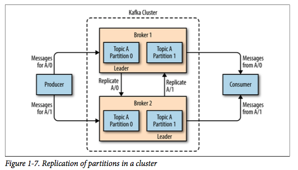
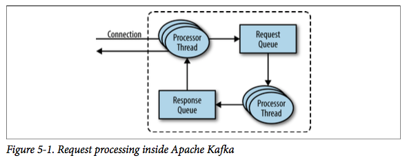
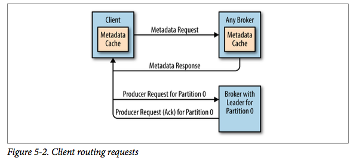
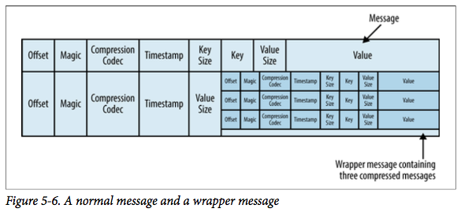

# Kafka

[kafka技术内幕](https://zqhxuyuan.github.io/2016/01/04/Kafka-Intro/)
[kafka 服务器优化](http://www.dengshenyu.com/%E5%88%86%E5%B8%83%E5%BC%8F%E7%B3%BB%E7%BB%9F/2017/11/08/kafka-install.html)
[mq 对比](http://www.ipshop.xyz/14446.html)

## broker

一个 kafka cluser 是由多个 broker 构成的

Kafka的一个关键性质是**日志保留(retention)**, 我们可以配置主题的消息保留策略，譬如只保留一段时间的日志或者只保留特定大小的日志。当超过这些限制时，老的消息会被删除。我们也可以针对某个主题单独设置消息过期策略，这样对于不同应用可以实现个性化。

> Note: Kafka本身不需要配置太多的JVM内存，一般5GB的堆就足够了。另外，**不建议**Kafka与其他应用同时部署，因为其他应用会分享系统的`page cache`而导致Kafka消费性能下降。

## controller

其中集群内 **某个broker** 会成为集群控制器（`cluster controller`），它负责管理集群，包括 **分配分区到broker, 选举分区的leader/follower,监控broker故障** 等.

集群中的**第一个broker**通过在Zookeeper的/controller路径下创建一个**临时节点**来成为控制器, 当其他broker启动时，也会试图创建一个临时节点，但是会收到一个"节点已存在"的**异常**，这样便知道当前已经存在集群控制器. 当控制器发生故障时，该临时节点会消失，这些broker便会**收到通知**，然后尝试去创建临时节点成为新的控制器

对于一个控制器来说，如果它发现集群中的一个**broker离开**时，它会检查该broker是否有分区的**主副本**，如果有则需要对这些分区选举出新的主副本。控制器会在**分区的副本列表**中选出一个**新的主副本**，并且发送请求给新的主副本和其他的跟随者；这样新的主副本便知道需要处理生产者和消费者的请求，而跟随者则需要向新的主副本同步消息。

如果控制器发现有新的broker（这个broker也有可能是之前宕机的）加入时，它会通过此broker的ID来检查该broker是否有分区副本存在，如果有则通知该broker向相应的分区主副本同步消息

每当选举**一个新的控制器时**，就会产生一个新的**更大的控制器时间戳**（`controller epoch`），这样集群中的broker收到控制器的消息时检查此时间戳，当发现消息来源于老的控制器，它们便会忽略，**以避免脑裂（split brain）**

## producer group

## consumer group

每个 **group coordinator** 是由 这个 `group+topic` 对应 `__consumer_offset` 所在的 **parition leader** 对应的 **broker** 决定的. 管理一个 group + offset.

一个 group 多个 consumer 之间如何有效的 rebalance partition consumer 的分配, 是通过 **状态机** 进行扭转, 所有 consumer 发送 `join group`, coordiantor 从中选出一个 **leader** 来进行 partition consumer 分配. 所有的 consumer 发送 `sync group` (非leader发送空request, leader发送分配策略), coordiantor 将分配策略从 response返回.

### consume

在读取消息上，kafka使用**零复制（zero-copy）**来提高性能。也就是说，kafka将文件（更准确的说，是page cache）的消息**直接**传给网络通道，并没有使用中间的buffer。这避免了内存的字节拷贝和buffer维护，极大地提高了性能。

### partition

## 特性

### 可靠性

1. 分区内消息有序
   1. 提供**至少一次（at-least-once）**的数据传输, 会存在数据重复(通过业务系统可以实现**仅有一次（exactly-once）**)
   2. [kafka-exactly-once-semantics](http://www.dengshenyu.com/kafka/2018/07/26/kafka-exactly-once-semantics.html)
   3. **This provides a guarantee that messages with the same key are always routed to the same partition**, 同一个 `key` 的 msg 保证在同一个partition, 这种在订单状态扭转的时候, 特别有意义!!
2. 只要存在一个副本存活, 数据都不会丢失
3. 只有所有isr中的所有数据都为in-sync的状态, 数据才是 commited的, 也就是可以被消费的
4. 消费者只能consume commited 数据

### 高吞吐

某个时刻生产者的生产速度远超于消费者的消费速度, kafka作为缓冲, 具备**流量削峰的特性**.

**写操作**时, 操作系统只是将数据写入**PageCache**, 同时标记Page属性为**dirty**. **定时做 flush**. 通过 PageCache 避免了在 JVM 的 heap 进行缓存带来不必要的性能影响:

- 如果在Heap内管理缓存，JVM的GC线程会**频繁扫描Heap**空间，带来不必要的开销。如果Heap过大，执行一次**Full GC**对系统的可用性来说将是极大的挑战
- 所有在在JVM内的**对象**都不免带有一个**Object Overhead**(千万不可小视)，内存的有效空间利用率会因此降低
- 所有的**In-Process Cache**在OS中都有一份**同样的PageCache**。所以通过只在PageCache中做缓存至少可以提高一倍的缓存空间。
- 如果Kafka重启，所有的In-Process Cache都会失效，而OS管理的PageCache依然可以继续使用。

**读操作**时, 先从 **PageCache**中查找, 如果发生缺页中断才进行磁盘调度, 最终返回需要的数据, 这里使用了 **zero-copy**, 直接从 PageCache 通过 `sendfile` 传输给 network socket, 减少 **application context <=> kernel context 之间的上下文切换, 以及buffer拷贝**.

## 请求处理

对于监听的每一个端口，broker都会运行一个**接收者（acceptor）线程**来**建立连接**，并且把连接交给一个**处理器（processor）线程**处理，处理器线程的数量是可配置的

客户端怎么知道哪个是主副本呢？通过使用另一种类型的请求来实现，那就是**元信息请求（metadata request）**。Kafka的**任意一个broker**都可以处理这种请求.

## 文件格式

每个段都单独存为一个文件，文件内存放消息和位移。**磁盘上的数据格式**、**生产者发送的数据格式**和**消费者读取的数据格式**都是一样的，使用相同的数据格式使得Kafka可以进行零拷贝优化，以及避免压缩和解压缩。

除了key/value和位移之外，每个消息还包含**消息大小、校验和（检测数据损坏）、魔数（标识消息格式版本）、压缩算法（Snappy、GZip或者LZ4）和时间戳（0.10.0新增）**

如果生产者使用压缩，那么发送更大的批量消息可以得到更好的网络传输效率，并且节省磁盘存储空间. 但是会消耗cpu

## 索引 .index

Kafka允许消费者从任意合法的位移拉取消息，也就是说如果消费者希望从位移为100的地方开始读取1MB的消息，broker需要在该分区的所有段中定位到该消息的位置然后开始读取数据。为了帮助broker迅速定位，Kafka对于每个分区都维护一个索引，该**索引**将**位移(offset)**->到**段**以及**段内偏移**

索引也是**按照段来切割**的，因此清理过期消息时相应的索引也可以很容易清理。另外，索引并没有维护校验和，因此如果索引损坏了，Kafka会重新读取段文件生成索引

## 压缩 log compaction

压缩只对 message 的 key **不为null**的时候生效, 并且分为 **dirty** 和 **clean** 两种数据.
