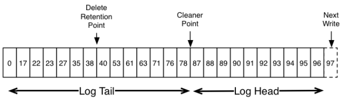

# log storage

## log 目录结构

kafka的数据都是以**日志形式**顺序存储的. `/{topic}-{partition_num}/{last_offset}.log |{last_offset}.index |{last_offset}.timeindex | leader-epoch-checkpoint`

`{last_offset}`为**上一个segment**的**最后一个消息的偏移**, `log`文件中保存了**所有的消息**, `index`文件中保存了**稀疏的相对偏移的索引**, `timeindex`保存的则是**时间索引**

`leader-epoch-checkpoint` 中保存了**每一任leader**开始写入消息时的offset,会定时更新, follower被选为leader时会根据这个确定哪些消息可用 //todo

### segment

kafka将每个分区切割成**段（segment）**. 默认**每个段**大小不超过`1G`，且只包含7天的数据. 如果段的消息量达到1G，那么该段会关闭, 同时打开一个新的段进行写入

正在写入的段称为**活跃段（active segment）**，活跃段**不会被删除**。因此，假如设置日志保留时间为1天，但是日志段包含5天的数据，那么我们实际上会保留5天的数据，因为活跃段正在使用而且在关闭前不会删除

对于每个分区的每个段（包括不活跃的段），broker都会维护文件句柄，因此打开的文件句柄数通常会比较多，这个需要适度调整系统的进程文件句柄参数。

## log manager

启动log manager实例时,如果已经存在日志文件，要把它们加载到内存中, 并且会启动多个**定时任务和线程**

| 组件 | 用途 | 关系 |
| ----- | --------- | ----------- |
| 日志保留任务 log retention | cleanupLogs | **删除**失效的segment或者为了控制日志**文件大小**要删除一些文件 |
| 日志刷写任务 log flusher | flushDirtyLogs | 根据时间策略，将还在操作系统 pagecache 的文件 flush 到磁盘上 |
| 检查点刷写任务 checkpoint | checkpointRecoveryPointOffsets | 定时地将checkpoint恢复点**状态写到**文件中 |
| 日志清理线程 cleaner | cleaner.startup() | log compact 日志压缩，针对**带有key**的消息的清理策略 |

### 日志清除

- 日志文件太大了需要删除**最旧的**数据，使得整体的日志文件大小不超过指定的值, 时间指日志文件中的**最大时间戳**而非文件的最后修改时间
- 清理**过期的segment**

### 日志压缩

对于 RDBMS 和 NoSQL数据库, 数据总要更新. 方式有两种:

1. 直接更新(RDBMS, 找到数据所在位置, 替换)
2. 追加数据(NoSQL, 保留旧值, 加入新值和timestamp)

追加数据的方式, 写性能很好. 代价是需要有专门的 compaction操作来对多条重复数据做merge.

压缩主要是解决NoSQL更新数据, 不断的追加, 导致存在很多过期数据, 占用空间, 影响性能.

每个Partition的（Leader Replica的）Log有**多个Segment**文件, 为了不影响正在写的最近的那个`activeSegment`, 日志压缩**不应该**清理activeSegment, 而是清理剩下的所有Segment

日志压缩保证:

1. 任何消费者如果能够赶上Log的Head部分，它就会看到写入的每条消息，这些消息都是顺序递增(中间不会间断)的offset, 因为压缩后的segment 会存在不连续的
2. 消息**总是** segment **有序**
3. 消息的 offset 永远不会改变, 以及对应的 value 也不变

#### 清理方法

几个Segment**分成一组**，分批清理。清理线程会占用一定的CPU，因为要读取已有的Segment并压缩成新的Segment，为了不影响其他组件（主要是读，因为读操作会读取旧的Segment，而写不会被影响因为写操作只往activeSegment写，而activeSegment不会被清理），可以设置**清理线程的线程个数**，同时Kakfa还支持Throttler限速（读取旧的Segment时和写入新的Segment都可以限速）。当然也并**不是**每个Partition在**同一时间**都进行清理，而是选择其中**最需要被清理**的Partition

- JVM: 垃圾回收算法将**存活的对象**拷贝/整理到**指定的区域**
- HBase/Cassandra: Compaction会将**多个数据文件**合并/整理成**新的数据文件**(按文件大小合并, 分层合并, 定时合并)
- kafka: LogCleaner清理Log时会将所有的Segment在CleanerPoint清理点位置分成`Tail`和`Head`两部分

清理后log `head`部分每条消息的offset都是**逐渐递增**的，而`tail`部分消息的offset是**断断续续**的

每个Partition的`Log(segment)`都对应一个`LogToClean`对象，在选择哪个Partition需要优先做Compaction操作时是依据`cleanableRatio`的比率=`Head部分大小（dirtyBytes）/总大小中最大`，假设日志文件一样大，firstDirtyOffset越小，dirtyBytes就越大。而firstDirtyOffset每次Compaction后都会增加，所以实际上选择算法是优先选择还没有发生或者发生次数比较少的Partition，因为这样的Partition的firstDirtyOffset没有机会增加太多。