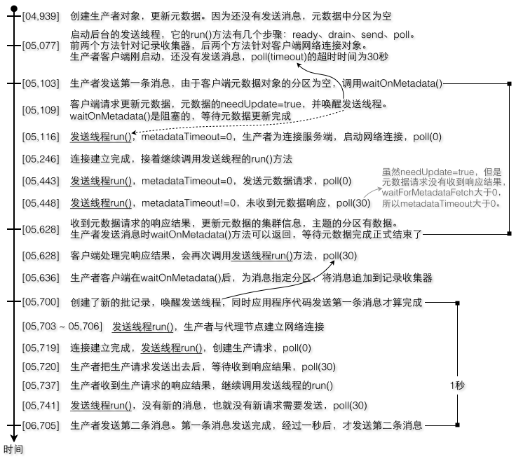
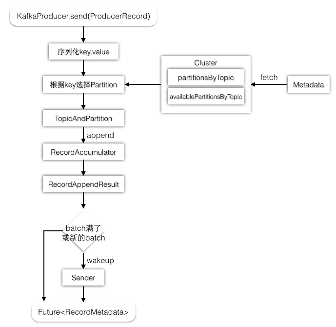
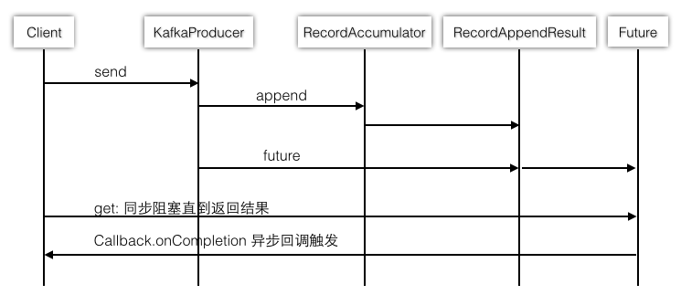
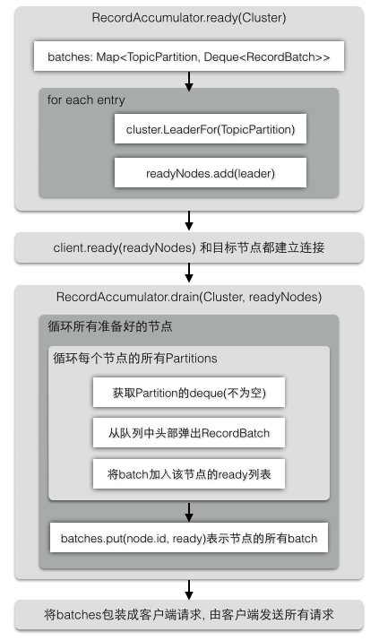
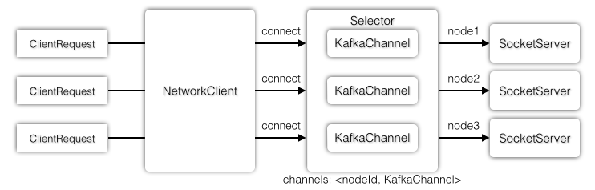
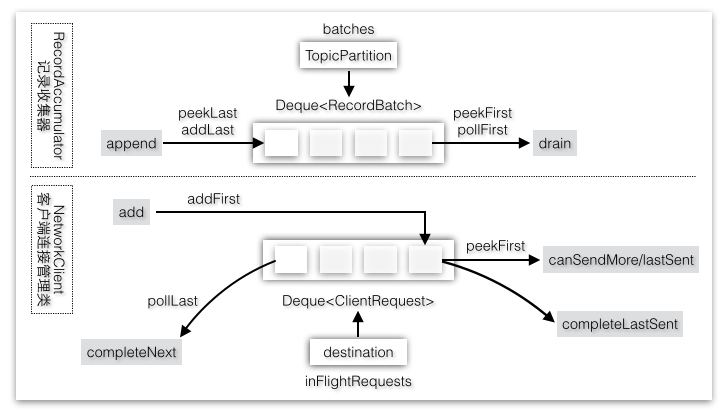
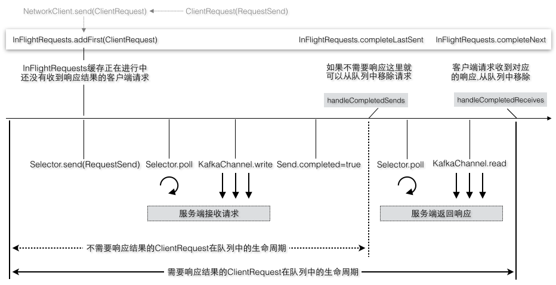
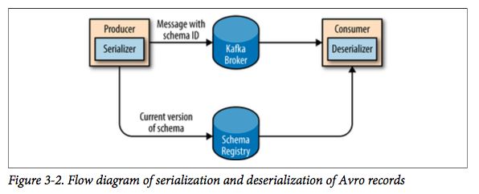

# producer

1. 生产者是如何确保将消息以分布式的方式存储到Kafka集群(**按照node分sender**)
2. 生产者客户端是如何组织消息，发送消息，并接收服务端的响应(**数据partition采集 + deque**)
3. 客户端和服务端的通信机制，如何有效运用线程模型更高效地通信(**使用selector + channel**)

**一个生产者**发送消息时在客户端就按照`节点和Partition进行分组`，属于**同一个目标节点**的**多个Partition**会作为**同一个请求**传送到服务端，作为目标节点的服务端也可以处理来自不同生产者客户端的请求

从**网络层**通信来看，客户端和服务端都会使用队列的方式确保顺序地客户端发送请求，服务端接收请求，服务端发送响应，客户端接收响应

从**存储层**来看，生产者会将消息分发到不同节点的不同Partition上，服务端的一个Partition的数据会来源于多个生产者

多个服务端节点组成的Kafka集群在**物理层**将消息分布在不同节点的不同Partition上，并且是以提交日志的形式追加到每个Partition中。对消息进行分区的好处是可以将大量的消息分成多批数据同时写到不同节点上，将写请求分担负载到各个节点

## producer send process

1. `producer.send()` 首先会判断 metadata **是否初始化**, 如果没有, 会`waitForMetadata`(这里是block阻塞的), 之后, 会把 data 缓存在 partition对应的 **accumulator** 中, 等待`isFull`等条件, 唤醒 **Sender线程**, 返回 一个 Feature
   1. 实际上在选择Partition的时候, 不要考虑replicas的存在，就只有Partition编号。每个Partition是分布在不同的节点上的（可以把这个Partition就认为是Leader Partition）。然后在写消息的时候采用round-robin方式将消息平均负载到每一个Partition上。假设第一条消息写到了topic1-part1，则下一条消息就写到topic1-part2，以此类推
2. **Sender** 是一个异步发送线程, 每隔 poll(timeout) 回去刷新一次 metadata, 当 **selector** 被唤醒, 会执行**发送数据**请求, 建立与 server 的链接, 并根据 key等获取 partition 对应的 **accumulator** 数据, 发送出去
3. 每次发送的batch数据都放至在一个 **inFlightRequests 双端队列**, 这里涉及到 **channel** 来处理i/o read/write

## 双端队列

[producer 源码分析](https://zqhxuyuan.github.io/2016/01/06/2016-01-06-Kafka_Producer/)

`deque双端队列` 两边都可以**加入和删除**. 如果**需要response**的, 从 head 加入, 从 `tail 删除`. **不需要response**的, 从 head 加入, 从 `head 删除`.

producer 每次发送, 要经历 **inFlightRequests 双端队列(只保存 发送完和正在发送的 但是没有收到响应的请求.)**, 并通过 KafkaChannel(设置 sender) 对外发送. 当 前一个 req1 发送完成(所有数据write all, 但是没有response)后, sender设置为null, 这时候新的 req2 才可以进入 inFlightRequests, 如果 req3 是一个不需要response的req, 等待 req2 发送完成(可以不需要response). req3 发送完成后, 即可从双端队列head poll. 所有的 req 都在 selector 中等待响应.

服务端也按照客户端队列的发送顺序, 有序返回.

Java版本的**客户端**和**服务端**的Processor都使用了`Selector选择器`模式和`KafkaChannel`, 在**服务端**还运用了`Reactor模式`将**IO部分**和**业务处理部分**的线程进行分离. 除此之外, 客户端和服务端在很多地方都运用了**队列**这种数据结构来对**请求或者响应**进行排队, 队列是一种保证数据被**有序**地处理并且能够**缓存**的结构

| 组件 | 用途 | 关系 |
| ----- | --------- | ----------- |
| RecordAccumulator 记录收集器 | 将消息按照Partition存储 | **收集消息**，提供消息给Sender |
| Sender 发送线程 | 针对**每个节点**都创建一个客户端**请求** | 将消息按照节点分组转交给NetworkClient |
| NetworkClient 客户端连接管理 | 管理**多个节点**的客户端请求 | 驱动Selector工作, 自己内部有一个`inFlightRequests deque` |
| Selector 选择器 | 以**轮询模式**驱动不同事件 | 通知KafkaChannel读写操作 |
| KafkChannel 网络通道 | 负责请求的发送和相应 | 从socket channel中读写字节缓冲区数据 |

在客户端要向服务端发送消息时我们会获取**Cluster集群状态（Java版本）/集群元数据TopicMetadata（Scala版本）**, 为消息选择`Partition`, 选择**Partition的Leader**作为**目标节点**, 在服务端SocketServer会接收客户端发送的请求交给Handler和KafkaApis处理

## 序列化/反序列化

kafka是使用字节进行数据交互的, 可以使用 avro/protobuf 等序列化方案, 但是**每次**传递都需要带上 avro 的信息**数据结构**, 会**增加**近一倍的数据量.

可以采用 schema registry 的方案, 将数据结构存储在一个 schema中心, 传递的时候带上 数据对应的 schema registry id即可.

## 可靠的写入

强一致性生产者保证:

1. 使用正确的acks参数来满足业务的可靠性需要(ack=all)
   1. replica 通过 isr 找到 leader/follwer 以及对应 partition 的log offset, 保存在内存中来做 `HW`/`log end offset` 判断, 是否 isr 是否加入/退出, 并且是否追赶
2. 正确处理写入消息的异常信息(异常记录/重写)
