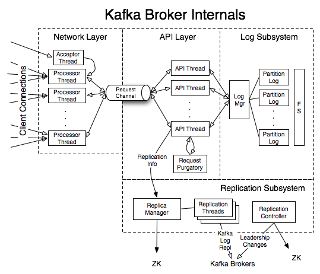

# socket server

[kafka socket server](https://zqhxuyuan.github.io/2016/01/08/2016-01-08-Kafka_SocketServer/)

## producer 与 broker 内部交互

SocketServer是一个NIO的服务器,它的线程模型:

- **1个 Acceptor 线程**接受/处理所有的新连接
- **n个 Processor 线程**, 每个Processor都有自己的selector, 从每个连接中读取请求, (Processor线程是**附属**在Acceptor线程中,随着Acceptor的创建而启动线程)
- **m个 Handler 线程**处理请求,并将产生的请求返回给Processor线程用于写回客户端

### acceptor

Acceptor**只有**监听客户端连接请求的ServerSocketChannel的`OP_ACCEPT`事件注册在上面, 只负责接受新的客户端的**连接**, 并将**请求转发**给Processor处理, 采用round-robin的方式分给不同的Processor

### processor

每个SocketChannel都代表服务端和客户端建立的连接,Processor通过一个Selector不断轮询(并不需要每个连接对应一个Selector)

- Acceptor会把多个客户端的数据连接SocketChannel分配给一个Processor，因此每个Processor内部都有一个队列来保存这些新来的数据连接, 把一个SocketChannel放到队列中，然后唤醒Processor的selector
- 如果有队列中有新的SocketChannel，则它首先将其`OP_READ`事件注册到该Processor的selector上面, 为了读取客户端发送的请求
- 之后所有的 read 动作, selector 都会感知到, 都会 poll 到.

## selecor 和 channel 交互

1. poll read/write 请求
2. receive 接受到的请求
3. send 响应信息