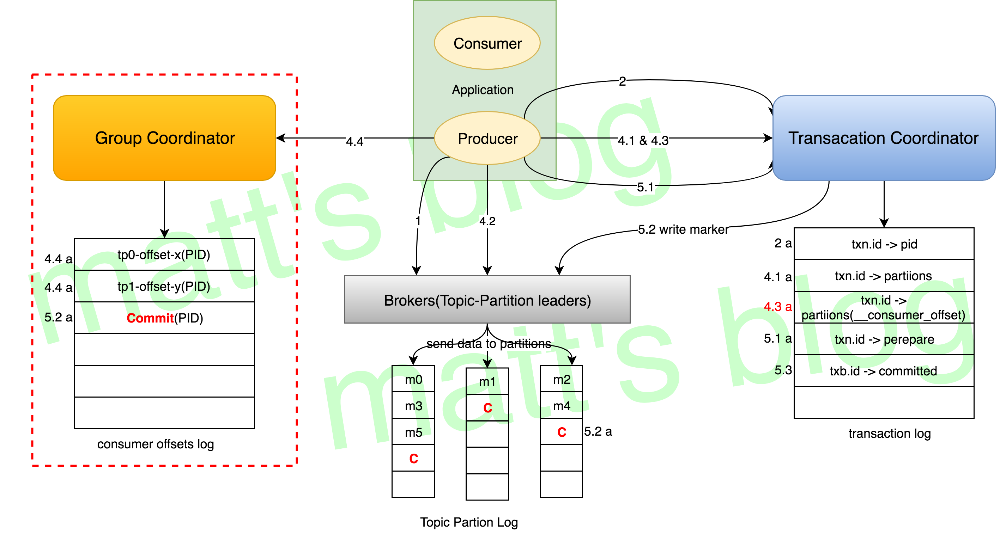

# transaction

[Kafka Exactly-Once 之事务性实现](http://matt33.com/2018/11/04/kafka-transaction/)

1. Atomic writes across multiple partitions.
2. All messages in a transaction are made visible together, or none are.
3. Consumers must be configured to skip `uncommitted messages`

## producer 使用事务

1. 设置 `props.put("transactional.id", "test-transactional")`
2. 设置 `props.put(ProducerConfig.ENABLE_IDEMPOTENCE_CONFIG, "true")`

## consumer 事务

1. 主动设置 `props.put(ConsumerConfig.ISOLATION_LEVEL_CONFIG, "read_committed")`

为了保持位移顺序，read_committed会使得消费者需要在获取到同一事务中的所有消息前需要缓存消息

## 场景

1. producer发的多条消息组成一个事务这些消息需要对consumer同时可见或者同时不可见
2. producer可能会给多个topic, 多个partition发消息, 这些消息也需要能放在一个事务里面, 这就形成了一个典型的分布式事务
3. kafka的应用场景经常是应用先消费一个topic, 然后做处理再发到另一个topic, 这个consume-transform-produce过程需要放到一个事务里面, 比如在消息处理或者发送的过程中如果失败了, 消费位点也不能提交
4. producer或者producer所在的应用可能会挂掉, 新的producer启动以后需要知道怎么处理之前未完成的事务
5. 流式处理的拓扑可能会比较深, 如果下游只有等上游消息事务提交以后才能读到, 可能会导致rt非常长吞吐量也随之下降很多, 所以需要实现read committed和read uncommitted两种事务隔离级别

## 关键词

1. 因为producer发送消息可能是分布式事务, 所以引入了常用的`2PC`, 所以有**事务协调者(Transaction Coordinator)**. Transaction Coordinator和之前为了解决脑裂和惊群问题引入的Group Coordinator在**选举和failover**上面类似. TransactionCoordinator 会将当前事务的**状态信息都会缓存**起来, 每当事务需要进行转移, 就**更新**缓存中事务的状态（前提是这个状态转移是有效的）
2. 事务管理中事务日志是必不可少的, kafka使用一个**内部topic来保存事务日志(Transaction Log)**, 这个设计和之前使用内部topic保存位点的设计保持一致。事务日志是Transaction Coordinator管理的状态的持久化, 因为不需要回溯事务的历史状态, 所以事务日志**只用保存最近**的事务**状态**, 由于也是一个 topic, 因此具备容错性和一致性.
3. 因为事务存在`commit`和`abort`两种**操作**, 而客户端又有`read committed`和`read uncommitted`两种**隔离级别**, 所以**消息队列**必须能**标识事务状态**, 这个被称作`control messages`
   1. 解决事务未`commit/abort`时, 数据保存问题
   2. producer 只需要 提交 `commit/abort` 给 **transactionCoordinator**, 由其 向 **partition leader** 发送`maker`
   3. 有了 `transaction maker`, 数据直接持久化到 log(标识数据是否是事务数据), 当收到 `maker` 也写入对应的 partition, consumer 消费时根据 `maker`信息做处理.
4. producer挂掉重启或者漂移到其它机器需要能关联的之前的未完成事务所以需要有一个唯一标识符来进行关联, 这个就是`TransactionalId`, 一个producer挂了, **另一个有相同 TransactionalId 的 producer**能够接着处理这个事务未完成的状态。(注意不要把TransactionalId和数据库事务中常见的transaction id搞混了, kafka目前**没有**引入全局序, 所以也没有transaction id, 这个`TransactionalId`是**用户提前配置**的)
5. TransactionalId能关联producer, 也需要避免两个使用相同TransactionalId的producer**同时存在**, 所以引入了`producer epoch`来保证对应**一个TransactionalId**只有一个**活跃的producer epoch**

## 事务语义

### 多分区原子写入(多partition)

事务能够保证Kafka topic下**每个分区**的原子写入, 从 topicA 读取 X 转换成 Y 后 写入 topicB, 这个可以是原子性的... // todo nani?

### 粉碎僵尸实例(多session)

为**每个事务producer**分配一个称为`transactional.id`的**唯一标识符**来解决僵尸实例的问题。在进程**重新启动**时能够识别**相同的producer实例**

API要求事务性Producer的**第一个操作**应该是在Kafka集群中**显示注册**transactional.id。 当注册的时候, Kafka broker用给定的transactional.id检查打开的事务并且完成处理. Kafka也增加了一个与transactional.id相关的`producer epoch`。Epoch存储每个transactional.id **内部元数据**

一旦这个epoch被触发, 任何具有**相同**的transactional.id和**更旧**的epoch的Producer被视为**僵尸**, 并被围起来, Kafka会**拒绝**来自这些Procedure的后续**事务性写入**

### 读事务消息不保证

**不能保证**所有被某事务Commit过的所有消息都被**一起消费**:

1. 对于压缩的Topic而言, 同一事务的某些消息可能被其它**版本覆盖**
2. 事务包含的消息可能分布在多个Segment中（即使在同一个Partition内）, 当**老Segment被删除**时, 该事务的部分数据可能会丢失
3. consumer在一个事务内可能**通过seek方法访问**任意Offset的消息, 从而可能丢失部分消息
4. consumer**无法**跨partition消费, 因此它将永远不会读取组成该事务的所有消息

## 原理

### 事务协调器

**事务Coordinator**是**每个**KafkaBroker内部运行的一个模块. 事务日志是一个**内部的Kafka Topic**. 每个Coordinator拥有事务日志所在**分区的子集**(partition leader)

关键对象:

1. TransactionStateManager: 这个对象, 从名字应该就能大概明白其作用是关于事务的**状态管理**, 它会维护分配到这个 TransactionCoordinator 的所有事务的 meta 信息
2. TransactionMarkerChannelManager: 这个主要是用于向其他的 Broker 发送 **Transaction Marker 数据**

功能:

1. 处理事务相关的请求
2. 维护事务的状态信息
3. 向其他 Broker 发送 Transaction Marker 数据

### 事务日志

topic: `__transaction_state`, 一个事务应该由哪个 TransactionCoordinator 来处理, 是根据其 txn.id 的 hash(txn)%(__transaction_state.partitionSize)得到, __transaction_state Partition 默认是50个

transaction log 保存的是 `hash(transaction.id), status(ongoing, prepare commit, completed)`, 只保存的是**最新消息`状态`而不是实际`消息`**

每个transactional.id都通过一个简单的**哈希函数**映射到事务日志的**特定分区**, 事务日志文件__transaction_state-0。这意味着只有一个Broker拥有给定的transactional.id // todo 怎么写和读?

### Server 状态机


正常流程:

- `Empty –> Ongoing –> PrepareCommit –> CompleteCommit –> Empty`
- `Empty –> Ongoing –> PrepareAbort –> CompleteAbort –> Empty`

### Client 状态机


Client 端的事务状态信息主要用于 Client 端的事务状态处理

### 流程



```java
while (true) {
    ConsumerRecords records = consumer.poll(Long.MAX_VALUE);
    producer.beginTransaction();
    //start
    for (ConsumerRecord record : records){
        producer.send(producerRecord(“outputTopic1”, record));
        producer.send(producerRecord(“outputTopic2”, record));
    }
    producer.sendOffsetsToTransaction(currentOffsets(consumer), group);
    //end
    producer.commitTransaction();
}
```

1. Finding a TransactionCoordinator, 从brokers中找到这个事务 `txn.id` 对应的 `TransactionCoordinator`.
2. Getting a PID, 从 `TransactionCoordinator` 获取 `producer.id`
   1. 如果是初次(**缓存中不存在/持久化中不存在**), 初始化 `TransactionMetadata(pid, epoch=-1)`, 否则返回 metadata(`epoch+=1`)
   2. 校验其 TransactionMetadata 的状态信息`prepareInitProduceIdTransit()`
   3. 将 txn.id 与相应的 `TransactionMetadata` **持久化**到**事务日志**中
3. Starting a Transaction, `initializeTransactions()`将**本地事务状态**转移成 IN_TRANSACTION, 并没有与 Server 端进行交互
4. Consume-Porcess-Produce Loop
   1. AddPartitionsToTxnRequest, `producer.send()`, **Sender线程**会将这个信息通过 AddPartitionsToTxnRequest 请求发送给TransactionCoordinator, TransactionCoordinator 会将这个 **parition 列表**更新到 `txn.id` 对应的 `TransactionMetadata` 中, 并且会**持久化**到**事务日志中**
   2. ProduceRequest, 写入消息数据, group partition leader 在持久化数据时会在头信息中标识这条数据**是**不是来**自事务 Producer** 的写入
   3. AddOffsetsToTxnRequest, `sendOffsetsToTransaction()`把这个 group.id 对应的 __consumer_offsets 的 Partition （与写入涉及的 Topic-Partition 一样）保存到事务对应的 meta 中, 之后会**持久化**相应的**事务日志**
   4. TxnOffsetsCommitRequest, Producer 在收到 TransactionCoordinator 关于 AddOffsetsToTxnRequest 响应后, 再次发送 TxnOffsetsCommitRequest 请求给对应的 `GroupCoordinator`, GroupCoordinator 在收到相应的请求后, 会将 `offset` 信息**持久化**到 `consumer offsets log` 中（包含对应的 PID 信息）, 但是**不会更新到缓存**中, 除非这个事务 commit 了, 这样的话就可以保证这个 offset 信息对 consumer 是不可见的（**没有更新到缓存中的数据是不可见的, 通过接口是获取不到的, 这是 GroupCoordinator 本身来保证的, 如果这时候coordinator 切换了, 好像就会有问题**）
5. Committing or Aborting a Transaction(`2PC开始`)
   1. EndTxnRequest, 无论是 Commit 还是 Abort, 对于 Producer 而言, 都是向 TransactionCoordinator 发送 EndTxnRequest 请求. TransactionCoordinator 在收到 EndTxnRequest 请求后
      1. 更新事务的 meta 信息, 状态转移成 `PREPARE_COMMIT` 或 `PREPARE_ABORT`, 并将事务状态信息**持久化**到事务日志中
      2. 根据事务 meta 信息, 向其涉及到的**所有 Topic-Partition** 的 **leader** 发送 **Transaction Marker/control message** 信息
      3. 最后将**事务状态**更新为 `COMMIT` 或者 `ABORT`, 并将事务的 meta 持**久化**到**事务日志**中
   2. WriteTxnMarkerRquest, TransactionCoordinator 收到 Producer 的 EndTxnRequest 请求后向其他 Broker 发送`maker`的请求, 主要是告诉它们事务已经完成。不论是普通的 Topic-Partition 还是 __consumer_offsets, 在收到这个请求后, 都会把**事务结果**（Transaction Marker 的格数据式见前面）**持久化**到**对应的日志文件**中, 这样下游 Consumer 在消费这个数据时, 就知道这个事务是 commit 还是 abort
   3. Writing the Final Commit or Abort Message, 当这个事务涉及到所有 Topic-Partition 都已经把这个 marker 信息持久化到日志文件之后, TransactionCoordinator 会将这个**事务的状态**置为 `COMMIT` 或 `ABORT`, **并持久化**到**事务日志**文件中, 到这里, 这个事务操作就算真正完成了, TransactionCoordinator **缓存**的很多关于这个事务的数据可以**被清除**了

## 思考

### txn.id 是否可以被多 Producer 使用, 如果有多个 Producer 使用了这个 txn.id 会出现什么问题

最后启动的 Producer 会**成功运行**, 它之前启动的 Producer 会都 **Fencing 掉**

### TransactionCoordinator Fencing 和 Producer Fencing 分别是什么, 它们是用来解决什么问题的

`Fencing` 机制**解决**的主要也是这种类型的问题 -- **脑裂问题**

#### TransactionCoordinator Fencing

当 coodinator 碰上 long FGC, 可能会导致 zk 连接超时, 导致 leader 选举.

每个 TransactionCoordinator 都有其 `CoordinatorEpoch` 值, 这个值就是对应 __transaction_state Partition 的 Epoch 值（每当 leader 切换一次, 该值就会自增1）.

旧的 coordinator 不会再收到新的请求, 但是自身会发送 `maker req` 给 broker, 这时候 broker 会比对对应的 epoch, 拒绝 req. 这时候 coordinator 知道自己过期, fencing.

#### Producer Fencing

当有新的producer生成时, 对应的 epoch 变成旧值, 在 coordinator 处理旧的 producer 会返回决绝, 这时候 producer 知道自己过期, fencing.

### 对于事务的数据, Consumer 端是如何消费的, 一个事务可能会 commit, 也可能会 abort, 这个在 Consumer 端是如何体现的

- **read_committed** 只会读取 `commit` 的数据, 过滤 `abort` 的数据
- **read_uncommitted** 这种模式, consumer 可以读取到所有数据（**control msg** 会过**滤掉**）. 为了保持位移顺序，会使得消费者需要在获取到**同一事务中的所有消息前需要缓存消息**(事物消息会被拉取, 在consumer端缓存并等待 control message 来决定是 commit 还是 abort)

#### Last Stable Offset（LSO）

consumer poll 在这个 offset 之前的**事务操作**都是**已经完成**的事务（已经 commit 或 abort）, 如果这个 Partition **没有**涉及到事务数据, 那么 `LSO` 就是其 `HW`（水位）

如果 Consumer 的消费策略设置的是 read_committed, 其在向 Server 发送 Fetch 请求时, Server 端只会返回 LSO 之前的数据, 在 LSO 之后的数据不会返回. **受 long transaction 的影响可能会导致数据有延迟**

#### Consumer 如何过滤 abort 的事务数据

Partition 的每个 log segment 都会有一个单独只写的文件（append-only file）来存储 abort transaction 信息, 因为 abort transaction 并不是很多, 所以这个开销是可以可以接受的, 之所以要持久化到磁盘, 主要是为了故障后快速恢复, 要不然 Broker 需要把这个 Partition 的所有数据都读一遍, 才能直到哪些事务是 abort 的, 这样的话, 开销太大（如果这个 Partition 没有事务操作, 就不会生成这个文件）. 这个持久化的文件是以 `.txnindex` 做后缀, 前面依然是这个 log segment 的 offset 信息

consumer在拉取数据时, Server 端会根据拉取的 offset 范围与 abort transaction 的 offset 做对比, 返回涉及到的 abort transaction 集合, Consumer 在拿到这些数据之后, 会进行相应的过滤

// todo

### 对于一个 Topic, 如果既有事务数据写入又有其他 topic 数据写入, 消费时, 其顺序性时怎么保证的

顺序性还是严格按照 offset 的, 只不过遇到 abort trsansaction 的数据时就丢弃掉, 其他的与普通 Consumer 并没有区别

### 如果 txn.id 长期不使用, server 端怎么处理

Server 端还有一个最大可允许的事务操作超时时间（参数是 transaction.timeout.ms, 默认是15min）, Producer 设置超时时间不能超过 Server, 否则的话会抛出异常

 `TransactionCoordinator` 会**缓存** `txn.id` 的**meta信息**, 如果超过这个时间没有任何事务相关的请求发送过来, TransactionCoordinator 将会使这个 `txn.id` **meta信息过期(删除)**

### PID Snapshot 是做什么的？是用来解决什么问题

每个 Topic-Partition, Broker 都会在内存中维护其 PID 与 sequence number 映射关系, 如果 broker 重启, 需要扫描 transaction log 来重建映射. 可以定时对这个 state 信息做 `checkpoint（Snapshot）`, 重启后只需要读取这个 snapshot 就可以了.

### 如果事务处于send没有commit中间, 有非事务消息插入. consumer 消费的offset是谁

`HW offset` 保存的是 **非事务消息插入**, 只有当commit 发生, 发送了 control message 后, consumer 才会读到 **maker消息(commit/abort transaction)**, 然后消费对应的事务. 事务使用的是 `LSO`, 非事务使用 `HW`
