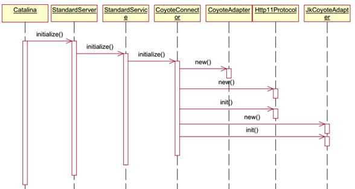
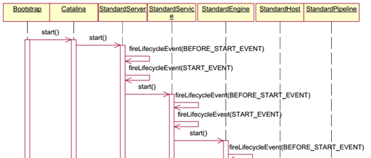

# Introduction


## 基本结构

Lifecycle 构建了整个 tomcat 的生命周期管理:

- connector

## init　& start

[tomcat 初始化/启动](https://blog.csdn.net/yangsnow_rain_wind/article/details/80049506)

[Tomcat组成与工作原理](https://juejin.im/post/58eb5fdda0bb9f00692a78fc)


init:


start:


`Bootstrap` 和 `Catalina`: 通过 init -> load -> start ...

- `init` 需要设置 classloader parent 和 classloader
- `load` 使用 **digester** 解析配置文件信息, 顺序是 server -> srv.nameResources -> srv.listeners -> srv.services -> svc.listeners -> svc.executors -> svc.connectors -> connector.listeners -> engine -> host -> context/cluster
  - 同时 init container/executor/connecotr
  - 在 **digester** 解析 container 的同时, 加入 `XxxConfig(ContextConfig)` listener, 在 container start/stop/reload 时解析对应的配置文件

`StandardServer` 使用一个 awaitSocket 来 hang. 选择对应的 `service` 和 `connector` ...

`StandardService` 每个 标准service 对应一个 enginer, 多个 executors, 以及多个 connector

`Connector` 在初始化时, 要指定一个 **protocol handler** 类型, 绑定一个 ProtocolHandler 和 ProtocolEndpoint, 每一个 endpoint 绑定一个 port

> 可以同时存在多个 connector, 但是每个 connector 的 listen port 必须是独立的.
>
> init 只会初始化到 engine container, 后面的 container 没有重写 startIniternal

`Endpoint` 下是一个执行线程池(executors), 并且有**多个 Acceptor 线程等待 accept**(使用 LimitLatch 做控制). 可以选择 init/start 时 bind

`Mapper` 在 connector 启动时, 会将 connector 对应的 service 下的 engine 对应的所有 host, host 下的所有 context, context 下的所有 wrapper 都注册到列表中

1. 当有一个 `accept` 请求时, 封装成 wrap, 从 executors 中取一个线程去执行. 将整个 socket 传入, 执行 `handler.process(Http1Processor)` 业务流程. 执行完成后, 如果是长连接LONG, 重新加入 socket 到 waitingRequests.
2. 有一个独立的 `AsynTimeout` 线程, `loop` waitingRequests 队列. 循环 Step 1
3. `Adapter` 实现将 **processor** 和 **connector** 进行连结. 使用 `mapper` 获取对应的 Context/Wrapper, request/response parse and check.
4. 通过 connector 获取到 service 下的 engine container, 并获取 pipeline 和 valves 调用链执行.

<details>
  <summary>使用 tomcat 自定义 web server 流程</summary>

``` java
/**
* 使用 tomcat 自定义 servlet
*/
    @Test
    public void connector() throws LifecycleException, InterruptedException {
        System.setProperty(Globals.CATALINA_HOME_PROP, "/tmp/webapps");
        System.setProperty(Globals.CATALINA_BASE_PROP, "/tmp/webapps");
// 这里类似 web.xml 的配置
/**
    <servlet>
        <servlet-name>xiaoxiaoWrapper</servlet-name>
        <servlet-class>HelloWorld</servlet-class>
    </servlet>
    <servlet-mapping>
        <servlet-name>xiaoxiaoWrapper</servlet-name>
        <url-pattern>/xiaoxiao</url-pattern>
    </servlet-mapping>
*/
        Context context = new StandardContext();
        context.setName("xiaoxiao context");
        context.setPath("/abc");
        context.addLifecycleListener(new Tomcat.FixContextListener());
        context.setDocBase(null);
//        context.addLifecycleListener(new ContextConfig());

        Wrapper wrapper = context.createWrapper();
        wrapper.setName("xiaoxiaoWrapper");
        wrapper.setServlet(new HelloWorld());
        wrapper.setParent(context);
        context.addChild(wrapper);
        context.addServletMapping("/xiaoxiao", "xiaoxiaoWrapper");

        Host host = new StandardHost();
        host.setName("localhost");
        host.addChild(context);
        host.addLifecycleListener(new HostConfig());
        context.setParent(host);

        Engine engine = new StandardEngine();
        engine.setName("aiur");
        engine.setDefaultHost("localhost");
        engine.addChild(host);
        host.setParent(engine);


        Service service = new StandardService();
        service.setName("trade");
        service.addLifecycleListener(event -> System.out.println("service type: " + event.getType() + ", data: " + event.getData() + ", life: " + event.getLifecycle().getStateName()));
        service.setContainer(engine);

        Connector connector = new Connector("HTTP/1.1");
        connector.setPort(8080);
        connector.addLifecycleListener(event -> System.out.println("connector type: " + event.getType() + ", data: " + event.getData() + ", life: " + event.getLifecycle().getStateName()));
        connector.setService(service);
        service.addConnector(connector);


        Server server = new StandardServer();
        server.addService(service);
        service.setServer(server);

        server.init();
        server.start();
        server.await();
    }
```

</details>

## container

1. 每个 container 都含有一个 start-stop  executors, 作用是处理 start/stop event
2. 只有 **enginer container** 保持有一个 `ContainerBackgroundProcessor` daemon thread 做后台定时调度
3. 每个 container 都内置有一个 StandardPipeline
4. 一个 container 内部可以包含多个 业务`Valve` 和一个 StandardXxxValve, 每个 valve 都指向下一个 valve, StandardXxxValve 指向下级 container, 通过 `pipeline` 来控制.

## LifeCycle

Container 都继承自 LifeCycle, 每个 lifecycle 都绑定一组 event listener, 因此所有的对此 container 部分 event 感兴趣都可以register 一个 listener.

通过 LifeCycle 可以管理整个 container 的生命周期, 基于 container 是父子继承关系的策略, 只需要管理 root container 即可

## 编码

使用 CharsetMapperDefault.properties 配置文件来控制编码
