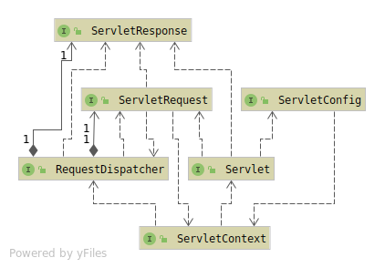

# Servlet

[servlet 本质](https://www.zhihu.com/question/21416727)

Java Servlet 是**运行在 Web 服务器或应用服务器上**的程序，它是作为来自 Web 浏览器或其他 HTTP 客户端的请求和 HTTP 服务器上的数据库或应用程序之间的**中间层**

> 我理解, servlet 不是 web 服务器, 只是建设在 web 服务器内都一层 业务逻辑层. 对客户端的 各种 **输入请求, 做处理, 输出响应**
>
> 当用户通过 URL 发出一个请求时，这些 Java servlet 类就将之转换成一个 HttpServletRequest，并发送给 URL 所指向的目标. 当服务器端完成其工作时，Java 运行时环境（Java Runtime Environment）就将结果包装在一个 HttpServletResponse 中，然后将原 HTTP 响应送回给发出该请求的客户机

## listener & event

1. event(`EventObject`), 什么事件
2. source(`Object`), 谁做的
3. listner(`EventListener`), 谁听到事件后做什么

**B(listener owner)** 对 **A(source)** 的 **fire(event)** 感兴趣, 往 A 的**监听容器**中注册了一个 addListener(B_Listener), 并且监听实现只对 fire 事件感兴趣, 这个监听容器会记录所有 A 传入的事件, 逐个调用 listener 发出通知.

## Servlet 体系结构

Servlet 的运行模式是一个典型的 **握手型的交互式** 运行模式

1. servlet **context**, 交易场景
2. servlet **config**, 提供 交易场景 初始化特殊变量
3. servlet **request**
4. servlet **response**
