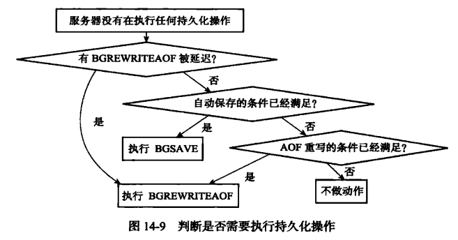

# Single Database

## 1. Database

redis server 有多个 databases, 客户端通过切换指针, 来切换数据库.

``` c++
struct redisServer {
    // 数组, 保存所有服务器中的数据
    redisDb *db;
    // 服务器数据的数量
    int dbnum;
}
```

``` c++
typedef struct redisClient {
    // 记录客户端当前使用的数据库
    redisDb *db;
} redisClient;
```

``` c++
typedef struct redisDb {
    // 数据库键空间, 保存着数据库中所有的键值对
    dict *dict;
} redisDb;
```

### 过期时间

``` c++
typedef struct redisDb {
    // 过期字典, 保存着键的过期时间
    dict *exipires;
} redisDb;
```

副用 dict 键值对的 redisObject, 节约空间.

过期键删除的策略:

1. 定时删除: CPU压力大
2. **惰性删除**: 内存压力大, 如果一直没有请求, 会一直占用内存, 而这个数据本来是可以释放的.
3. **定期删除**: 综合, 删除的数量最好能根据算法动态变更

Redis 使用 2, 3 的删除策略.

1. 在每次 读写操作命令执行之前, 都会对应的键是否过期.
2. 周期性的, 定时的, 便利数据库中的 exipres 字典, 随机检查(顺序, 指定数量)键的过期时间, 删除过期键

### RDB 和 AOF

RDB 在 `SAVE/BGSAVE` 的时候会检查库中的键, 过期的键不会被保存.

RDB 在 `LOAD` 的时候, master 会过滤掉过期的键, slave 不做过滤. 因为最后会以 master 做一次数据同步.

AOF 在 处理过期键的时候, 会从内存中删除键, 并在 AOF 文件中 append 一条 DEL 命令.

AOF 在 `BGREWRITEAOF` 的时候, 会过滤掉过期的键

### 复制模式

1. master 删除一个过期键, 会向所有 slave 发送一个 DEL 命令.
2. slave 读命令, 碰到过期键 也不会 删除
3. slave 只有读到 master 发送的 DEL 才会删除

## 2. RDB

RDB 是一个**经过压缩的二进制文件**, 可以通过此文件还原生成RDB文件时的数据库状态.

`SAVE` 会block住进程.

`BGSAVE` 会 fork 一个子进程(cow)来创建新的RDB, 并且在此期间**不接受**新的 `BGSAE/BGREWRITERAOF` 命令.

`LOAD` 的时候, 进程会一直 block, 直到 LOAD 结束.

由于 AOF 文件更新的频率高, 因此:

1. 服务开启了 AOF 功能, 优先使用 AOF 文件
2. 关闭了 AOF, 才会使用 RDB 还原数据

### 自动隔离性保存

``` c++
struct redisServer (
    // 记录了保存条件的数组
    struct saveparam *saveparams;
    // 修改计数器, 每次更新都会+1
    long dirty;
    // 上一次保存时间
    time_t lastsave;
);

struct saveparam (
    // 秒
    time_t seconds;
    // 修改书
    int changes
);
```

redis 服务器周期性操作函数 `serverCron` 每隔默认 100ms 会执行一次. 使用 saveparam 和 dirty+lastsave 做比较条件. 条件达到, 会执行对应的 SAVE/BGSAVE.

### 结构


**check_sum** 是一个 8 字节长的无符号整数， 保存着一个校验和， 这个校验和是程序通过对 REDIS 、 db_version 、 databases 、 EOF 四个部分的内容进行计算得出的


如果不带时间戳, 没有EXPIRETIME_MS和ms

value的编码分成5种对象: 字符串对象, 列表对象, 哈希表对象, 集合对象,有序集合对象

### 问题

在 间隔期间, crash, 可能会丢失部分数据

## 3. AOF

``` c++
struct redisServer (
    // aof 缓存区
    sds aof_buf;
);
```

保存所有修改数据的**写命令**.

分成**追加**(append memory and aof buffer), **写入**(write page cache), **同步**(fsync).

数据先追加进内存 和 aof缓存区, 将aof buffer写入文件(实际由于操作系统存在page cache, 并没有写入磁盘), 定时fsync同步到磁盘(将page cache flush 到 磁盘).appendfsync的策略极大的影响性能和持久化

服务器在每次 结束一个**事件循环**前会调用 `flushAppendOnlyFile` 函数, 考虑是否将 aof buffer 写入和保存至 AOF 文件.

### 载入与数据还原

1. 创建一个不带网络链接的客户端 `fake client`.(因为redis 命令只能在客户端上下文执行)
2. 从 AOF 文件中分析并**读取**一条命令
3. 使用 `fake client` **执行**命令
4. 重复执行 2,3 直到结束

### AOF 重写

解决 AOF 中大量冗余的语句.

1. 遍历读取数据库中所有的键值对, 将数据重写到新的 AOF 文件.
2. 为了防止 列表, hash表, 集合 数据过大, 导致客户端输入缓存区溢出, 需要检查元素数量, 使用一个**常量(64)**做**分页**处理.
3. 为了防止 rewrite 影响进程. fork 一个子进程(带有副本), 可以避免锁.
4. 为了防止 rewrite 过程中新数据的丢失, 加入一个 aof_rewrite_buf 缓存区, 每次新数据写入, 要同时追加至 aof_buf 和 aof_rewrite_buf
5. 当 子线程 完成rewrite, 发送**完成信号**通知父线程, 父线程 需要 block, 将 aof_rewrite_buf 的数据写入 新的aof 文件中(此时两份数据保持一致, 因为 redis 是单线程处理的). 对 **新的aof** 文件改名, 原地**覆盖** 现有的aof文件

## 4. 事件

redis 服务器是 **事件驱动** 程序:

1. **文件事件**: redis服务器通过套接字与客户端进行连接, 文件事件是 对套接字**操作的抽象**. 服务器与客户端的通信产生相应的文件事件. 服务器通过*监听*并处理这些时间来完成网络通信操作.
2. **时间事件**

### 文件事件

redis 基于 **reactor模式** 开发了网络时间处理器: **文件事件处理器(file event handler)**

1. 使用 **I/O多路复用** 程序 监听多个套接字, 并关联不同的处理器
2. 当被监听的套接字 准备好 accpet, read, write, close 等操作, 文件事件处理器 调用对应的 事件处理器

文件事件处理器是 **单线程**, 但是使用 I/O多路复用 监听多个套接字,实现了**高性能网络通信模型**, 与其他单线程运行模块对接.

**文件事件处理器**的四个组成:

1. 套接字
2. I/O多路复用程序
3. 文件事件分派器
4. 事件处理器


因为一个服务器通常会连接多个套接字， 所以多个文件事件有可能会并发地出现. 尽管多个文件事件可能会并发地出现， 但 I/O 多路复用程序总是会将**所有产生事件的套接字**都**入队到一个队列**里面， 然后通过这个队列， 以**有序（sequentially）、同步（synchronously）、每次一个套接字**的方式向文件事件分派器传送套接字： 当**上一个套接字产生的事件**被**处理完毕之后**（该套接字为事件所关联的事件处理器执行完毕）， I/O 多路复用程序**才会继续**向文件事件分派器**传送下一个套接字**


#### I/O 多路复用程序的实现

通过包装常见的 `select 、 epoll 、 evport` 和 `kqueue` 这些 I/O 多路复用函数库来实现的


#### 事件类型

套接字有两种类型, read / write.

I/O 多路复用程序可以监听多个套接字的 `ae.h/AE_READABLE` 事件和 `ae.h/AE_WRITABLE` 事件， 这两类事件和套接字操作之间的对应关系如下：

- 当套接字变得可读时（客户端对套接字执行 write 操作，或者执行 close 操作）， 或者有新的可应答（acceptable）套接字出现时（客户端对服务器的监听套接字执行 connect 操作）， 套接字产生 AE_READABLE 事件
- 当套接字变得可写时（客户端对套接字执行 read 操作）， 套接字产生 AE_WRITABLE 事件

如果 套接子变得 又读又写, 先读后写策略.

> 当套接字 read 的时候, 说明客户端正在对套接字执行 write, 服务器需要从套接字 read 到客户写入的信息
> 当套接字 write 的时候, 说明服务器正在对套接子执行 write, 客户端需要从套接子 read 到服务器写入的信息

#### API

以下很像一个多路复用的实现策略.

`ae.c/aeApiPoll` 函数接受一个 sys/time.h/struct timeval 结构为参数， 并在指定的时间內， 阻塞并等待所有被 aeCreateFileEvent 函数设置为监听状态的套接字产生文件事件， 当有**至少一个事件产生**， **或者**等待超时后， 函数返回。

ae.c/aeProcessEvents 函数是文件事件分派器， 它**先调用** aeApiPoll 函数来等待事件产生， 然后**遍历所有已产生的事件**， 并调用相应的事件处理器来处理这些事件

#### 文件事件的处理器

处理器有很多:

1. 为了对连接服务器的各个客户端进行应答， 服务器要为监听套接字关联**连接应答处理器**。
2. 为了接收客户端传来的命令请求， 服务器要为客户端套接字关联**命令请求处理器**。
3. 为了向客户端返回命令的执行结果， 服务器要为客户端套接字关联**命令回复处理器**。
4. 当主服务器和从服务器进行复制操作时， 主从服务器都需要关联特别为复制功能编写的**复制处理器**。
5. 等等。

连接应答处理器:

> `networking.c/acceptTcpHandler` 函数是 Redis 的连接应答处理器， 这个处理器用于对连接服务器监听套接字的客户端进行应答， 具体实现为 `sys/socket.h/accept` 函数的包装
> 
> 当 Redis 服务器进行**初始化**的时候， 程序会将这个**连接应答处理器**和服务器监听套接字的 `AE_READABLE 事件` **关联**起来， 当有客户端用 `sys/socket.h/connect` 函数连接服务器监听套接字的时候， 套接字就会**产生** AE_READABLE 事件， 引发连接应答处理器执行， 并执行相应的套接字应答操作

命令请求处理器:

> `networking.c/readQueryFromClient` 函数是 Redis 的命令请求处理器， 这个处理器负责从套接字中读入客户端发送的命令请求内容， 具体实现为 `unistd.h/read` 函数的包装
>
> 当一个客户端通过连接应答处理器成功连接到服务器**之后**， 服务器会将客户端**套接字**的 `AE_READABLE 事件`和命令请求处理器**关联**起来(本来这里 AE_READABLE事件 是和 连接应答处理器关联的)， 当客户端向服务器发送**命令请求**的时候， 套接字就会`产生 AE_READABLE 事件`， 引发命令请求处理器执行， 并执行相应的套接字读入操作
>
> 客户端连接服务器的**整个过程**中， 服务器都会**一直**为客户端套接字的 AE_READABLE 事件**关联命令请求处理器**

命令回复处理器:

> `networking.c/sendReplyToClient` 函数是 Redis 的命令回复处理器， 这个处理器负责将服务器执行命令后得到的命令回复通过套接字返回给客户端， 具体实现为 `unistd.h/write` 函数的包装
> 
> 当服务器**有命令回复**需要传送给客户端的时候， 服务器会将客户端套接字的 `AE_WRITABLE 事件`和命令回复处理器**关联**起来， 当**客户端准备**好接收服务器传回的命令回复时， 就会`产生 AE_WRITABLE 事件`， 引发命令回复处理器执行， 并执行相应的套接字写入操作
>
> 当命令回复发送**完毕**之后， 服务器就会**解除**命令回复处理器与客户端套接字的 AE_WRITABLE 事件之间的**关联**


### 时间事件

1. 定时事件
2. 周期事件

所有的时间事件都保存在一个无序链表中(时间无序, 按照ID有序), 时间事件执行器执行时, 遍历整个链表. 性能并不差, 原因是只有 serverCron 用到了时间事件.

serverCron 主要工作:

1. 更新服务器各类统计信息, 时间, 内存占用, 数据库占用等...
2. 清理过期键值
3. 关闭和清理失效客户端
4. 尝试 RDB 和 AOF 持久化
5. master 定期和 slave 同步
6. 集群模式进行 定期同步 和 连接测试

### 事件调度与执行

``` python
def aeProcessEvents():
    aeApiPoll(timeval) // 阻塞并等待文件事件产生
    processFileEvents() // 处理产生文件事件
    processTimeEvents() // 处理已经到达的时间事件

def main():
    // 初始化服务器
    init_server()
    // 一直处理事件, 直到服务器关闭
    while server_is_not_shutdown():
        aeProcessEvents()
    // 服务器关闭, 执行清理
    clean_server()
```

1. 因为是单线程处理事件, 服务器不会中断和抢占事件, 文件事件和时间事件是合作关系, 服务器会轮流处理两种时间, 事件应该**尽可能的减少程序的阻塞时间**, 在必要的时候主动让出执行权, 降低造成饥饿的可能.
2. 时间事件可能会执行的比预期晚一些.

## 5. 客户端

``` c++
struct redisServer (
    // 客户端链表
    list *clients;
);
```

``` c++
typedef struct redisClient (
    // 套接字描述符
    // -1 伪客户端(fake client)描述符
    // > -1 普通客户端描述符
    int fd;
    // 客户端名, 字符串
    robj *name;
    // 客户端的角色以及目前所处的状态
    // 可以是单个标识, 也可以是多个标识的 或|
    int flags;
    // 输入缓冲区, 最大输入不能超过 1GB
    sds querybuf;
    // 解析输入的命令, 命令参数, argv[0]是命令
    robj **argv;
    // 解析输入的命令, 命令参数个数
    int argc;
    // 输入的命令对应的命令结构, 通过 argv[0] 的值
    // 查找 命令字典表, 获得对应的 命令结构, 指针指向
    struct redisCommand *cmd;
    // 输出缓冲区, 命令的回复信息, 固定缓冲区
    // 固定缓冲区, 保存长度较小的回复, 当回复太大无法放置, 会放置到可变缓冲区
    // REDIS_REPLY_CHUNK_BYTES = 16 * 1024 = 16 KB
    char buf[REDIS_REPLY_CHUNK_BYTES];
    // 记录当前 buf 使用的量
    int bufpos;
    // 输出缓冲区, 命令的回复信息, 可变缓冲区
    list *reply;
    // 客户端是否通过了身份验证
    // 0 未通过
    // 1 已通过
    int authenticated;
    time_t ctime;
    time_t lastinteraction;
    // 输出缓冲区第一到达软性限制(soft limit)的时间
    time_t obuf_soft_limit_reached_time;
) redisClient;
```

### 输入缓冲区 和 输出缓冲区

输入缓冲区有 1GB 限制, 解析命令参数, 找到对应的 redisCommand

输出缓冲区分为 固定 和 动态:

1. 固定 16KB, 小回复
2. 动态理论不做限制, 实际上收到 hard limit 和 soft limit 限制.

### 创建普通客户端

客户端通过网络连接, 发送 connect, 服务器调用 连接时间处理器, 生成 redisClient 将其加入 clients 列表尾部

### 关闭普通客户端

1. 客户端主动退出
2. 客户端发送了**不符合协议**的请求命令.
3. 客户端成为 `CLIENT KILL` 命令的目标
4. 客户端设置了timeout, 空转了 timeout 时间.
5. 客户端发送的请求**超过**了输入缓冲区 **1GB**
6. 返回的回复信息长度**超过**了 输出缓冲区, 为了**避免** 客户端的可变缓冲区**过大**, 增加了两种模式限制
   1. **硬性限制(hard limit)**: 超过此值立即关闭.
   2. **软性限制(soft limit)**: 超过此值, 没有超过 hard limit, 记录开始时间, 如果在一定时间内, 没有再超过软性限制, 不做关闭.

### 伪客户端

1. `Lua 脚本`伪客户端: 初始化时创建, 负责执行 lua 脚本中的 redis 命令, 在服务器整个生命周期都存在.
2. `AOF 文件`伪客户端: 初始化时创建, 负责执行 AOF 文件包含的 redis 命令, 载入完成后关闭.

## 6. 服务器

命令执行预备操作:

1. 如果服务器打开了 `maxmemory` 功能, 在执行命令前, 会检查服务器的内存占用情况, 在需要的时候进行**内存回收**. 

命令执行完成后:

1. 如果开启慢查询, 会检测命令执行是否符合慢查询. 如果符合, 记录一条慢查询日志.

### serverCron

``` c++
struct redisServer (
    // 下面两种都不是很精确, 因为每隔 100ms 才更新一次
    // 需要准确的需要 调用系统时间
    // 秒级 系统当前 unix 时间戳
    time_t unixtime;
    // 毫秒级 unix 时间戳
    long long mstime;

    // 默认 每10s更新一次始终缓存
    // 用于计算键的空转(idle)时长
    unsigned lruclock:22;

    // 每秒服务器执行命令的次数, 抽样的估算
    // 上次抽样的时间
    long long ops_sec_last_sample_time;
    // 上次抽样 服务器执行命令的次数
    long long ops_sec_last_sample_ops;
    // 数组中每个项都记录了一次抽样结果, REDIS_OPS_SEC_SAMPLES 默认 16 的环形数组
    long long ops_sec_samples[REDIS_OPS_SEC_SAMPLES]
    // ops_sec_samples 数组的索引, 每次抽样后+1, 16后置0
    int ops_sec_index;

    // 已使用内存峰值
    size_t stat_peak_memory;

    // 关闭服务器标识
    // 1 关闭服务器, 0 不做动作
    int shutdown_asap;

    // 1 表示有 BGREWRITEAOF 命令被延迟了
    int aof_rewrite_scheduled;
    // 记录 BGSAVE 命令的子进程 ID; 如果没有, 为 -1
    pid_t rdb_child_pid;
    // 记录 BGREWRITEAOF 命令的子进程 ID; 如果没有, 为 -1
    pid_t aof_child_pid;

    // serverCron 函数运行次数计数器
    int cronloops
);

typedef struct redisObject {
    // 记录对象最后一次被访问时间
    unsigned lru:22;
} robj;
```

- 当服务器要计算数据库键的空转时间, 会用`(lruclock:22 - lru:22)` 计算
- 更新每秒服务器执行命令的次数

``` c++
/**
* 计算 每秒服务器执行命令的次数, 抽样的估算
*/
long long getOperationsPerSecond(void) {
    int j;
    long long sum = 0;
    for (j=0; j<REDIS_OPS_SEC_SAMPLES; j++) {
        sum += ops_sec_samples[j];
    }
    return sum / REDIS_OPS_SEC_SAMPLES;
}
```

- 在启动服务器的时候, 会启动一个 **SIGTERM 信号关联处理器**, 当收到 SIGTERM 信号的时候, 会将 shutdown_asap 设置为 1.
- 管理客户端资源, 每次会调用一定数量的 `clientsCron`.
  - 判断是否需要释放客户端链接
  - 防止客户端输入缓存区占用内存过多. 主动释放
- 管理数据库资源, 每次会调用 `databasesCron`, 此函数会对数据库做检查, **删除过期的键**, 对**字典做收缩操作**.
- 执行被延迟的 BGREWRITEAOF, 当在执行 BGSAVE 的时候, 请求的 BGREWRITEAOF 会被延迟, 修改 aof_rewrite_scheduled 为 1. 这时候要执行.
- 检查持久话操作的运行状态
- 
- 将 aof 缓存区内容, 写入 aof 文件
- 关闭**异步客户端**(超出缓存区大小的客户端)

### 初始化服务器

1. 初始化服务器**状态结构**, `initServerConfig()`
2. 载入配置项, `initServerConfig()`
3. 初始化服务器**数据结构**, `initServer()`
4. 还原数据库状态
5. 执行循环事件
