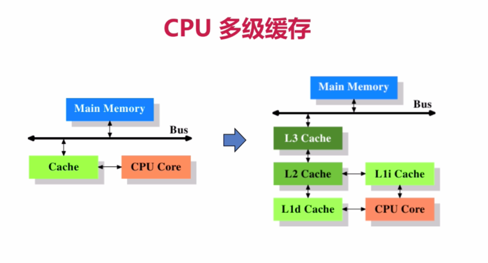

# cpu

[JAVA 拾遗 — CPU Cache 与缓存行](https://www.cnkirito.moe/cache-line/)

[7个示例科普CPU CACHE](https://coolshell.cn/articles/10249.html)

## cpu cache

CPU高速缓存是用于减少处理器访问内存所需平均时间的部件。在金字塔式存储体系中它位于自顶向下的第二层，仅次于CPU寄存器。其容量远小于内存，但速度却可以接近处理器的频率。



## cpu cache line

缓存行 (Cache Line) 便是 `CPU Cache` 中的**最小单位**，CPU Cache 由若干缓存行组成，**一个缓存行**的大小通常是 `64 字节（这取决于 CPU）`，并且它有效地引用**主内存中的一块地址**。一个 Java 的 long 类型是 8 字节，因此在一个缓存行中可以存 8 个 long 类型的变量


CPU 缓存在**顺序访问连续内存数据**时挥发出了最大的优势

## 伪共享

**多个线程**同时读写**同一个缓存行**的不**同变量**时导致的 **整个 cpu cache line 失效**


### 字节填充

只需要保证不同线程的变量存在于不同的 CacheLine 即可，使用多余的字节来填充可以做点这一点

java6:

``` java
public class PaddingObject{
    // java long object header 占用 8 byte
    public volatile long value = 0L;    // 实际数据
    public long p1, p2, p3, p4, p5, p6; // 填充
}
```

java7:

``` java
abstract class AbstractPaddingObject{
    protected long p1, p2, p3, p4, p5, p6;// 填充
}

public class PaddingObject extends AbstractPaddingObject{
    public volatile long value = 0L;    // 实际数据
}
```

java8:

``` java
@Retention(RetentionPolicy.RUNTIME)
@Target({ElementType.FIELD, ElementType.TYPE})
public @interface Contended {
    String value() default "";
}
// 注意需要同时开启 JVM 参数：-XX:-RestrictContended=false
```

> ConcurrentHashMap 中，使用 `@sun.misc.Contended` 对静态内部类 CounterCell 进行修饰. (因为会**频繁并发**的**读和修改**, 针对 cpu cache 不做字节填充, 会退化缓存功效)
> Thread 中, 使用 `@sun.misc.Contended`

### 遍历同样大小的数组和链表， 哪个比较快

1. **数组** 结构是连续的内存地址，所以数组全部或者部分元素被**连续存在CPU缓存**里面， 平均读取每个元素的时间只要3个CPU时钟周期
2. **链表** 的节点是分散在堆空间里面的，这时候CPU缓存帮不上忙，**只能是去读取内存**，平均读取时间需要100个CPU时钟周期

这样算下来，数组访问的速度比链表快33倍
