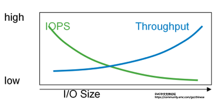

# IO

[文件IO操作的一些最佳实践](https://www.cnkirito.moe/file-io-best-practise/)

[进程操作 br, mmap, malloc](http://abcdxyzk.github.io/blog/2015/08/05/kernel-mm-malloc/)

[Linux Cache 机制探究](http://abcdxyzk.github.io/blog/2015/09/18/kernel-mm-cache-base/)

[mmap channel benchmark](https://segmentfault.com/a/1190000019154820)

[认真分析mmap：是什么 为什么 怎么用](https://www.cnblogs.com/huxiao-tee/p/4660352.html)


## 1. FileChannel

基于 ByteBuffer 实现操作(基于 **block 操作, 提升性能, 4kb**). read/write 是基于 `synchronized(optionLock)` 实现**线程安全**

FileChannel 只有在一次写入 `4kb` 的整数倍时，才能发挥出实际的性能，这得益于 FileChannel 采用了 ByteBuffer 这样的内存缓冲区. 4kb 一定快吗？也不严谨，这主要取决你机器的 **磁盘结构，并且受到操作系统，文件系统，CPU** 的影响，例如中间件性能挑战赛时的那块盘，一次至少写入 64kb 才能发挥出最高的 IOPS

`FileChannel` 将 `ByteBuffer` 中的数据也不会马上写入到磁盘中，也是先写到`pagecache`，但是 FileChannel 通过 ByteBuffer 可以控制**写盘的大小**，它当然会**尽可能**写满一块数据块(4kb)，然后再调用 `force()` 方法，用于通知操作系统进行及时的刷盘

### PageCache 影响性能

1. PageCache 属于操作系统层面的概念，用户层面很难干预，User BufferCache 显然比 Kernel PageCache 要可控
2. 现代操作系统会使用尽可能多的空闲内存来充当 PageCache，当操作系统回收 PageCache 内存的速度低于应用写缓存的速度时，会影响磁盘写入的速率，直接表现为**写入 RT 增大**，这被称之为**“毛刺现象”**

### DirectBuffer 和 HeapBuffer

- directBuffer 直接在堆外开辟内存, 使用 `malloc`, 但是 `malloc` **超过 128k**会自动使用 `mmap`, **128k 以内**使用 `br`. DirectByteBuffer是MappedByteBuffer的一个子类.
  - `数据 -> 系统内存 -> PageCache -> 磁盘`
- heapBuffer 在堆内开辟内存.
  - `数据 -> 工作内存 -> 系统内存 -> PageCache -> 磁盘`
- mappedDirectBuffer 直接在堆外开辟内存, 使用 `mmap`
  - `数据 -> 虚拟系统内存(类似PageCache) -> 磁盘`

## 2. MMAP

> 使用 `mmap` 把文件映射到用户空间里的**虚拟内存(可以理解成PageCache)**，**省去**了从**内核缓冲区(和 PageCache 一样是由操作系统来控制刷盘)**复制到用户空间的过程，文件中的位置在虚拟内存中有了对应的地址，可以像**操作内存一样操作这个文件**，相当于已经把整个文件放入内存，但在真正使用到这些数据前却不会消耗物理内存，也不会有读写磁盘的操作，只有真正使用这些数据时，也就是图像准备渲染在屏幕上时，虚拟内存管理系统 VMS 才根据缺页加载的机制从磁盘加载对应的数据块到物理内存进行渲染。这样的文件读写文件方式少了数据从内核缓存到用户空间的拷贝，效率很高

MMAP 并非是文件 IO 的银弹，它只有在 **一次写入很小量数据** 的场景下才能表现出比 FileChannel 稍微优异的性能

MappedByteBuffer 映射出一片文件内容之后，**不会全部加载到内存**中，而是会进行**一部分的预读**（体现在占用的那 100M 上），MappedByteBuffer 不是文件读写的银弹，它仍然**依赖于 PageCache 异步刷盘**的机制。

**优先**使用 `FileChannel(大于 4kb，请使用 FileChannel)` 去完成初始代码的提交，在必须使用**小数据量(例如几个字节, 读 4kb 以下的数据，请使用 mmap)刷盘**的场景下，再换成 `MMAP` 的实现.

## 3. DirectIO

1. 操作系统限制：Linux 操作系统在 2.4.10 及以后的版本中支持 `O_DIRECT` flag，老版本会忽略该 Flag；Mac OS 也有类似于 O_DIRECT 的机制
2. 用于传递数据的缓冲区，其**内存边界必须对齐**为 `blockSize` 的**整数倍**
3. 用于传递数据的缓冲区，其传递数据的**大小**必须是 `blockSize` 的**整数倍**
4. 数据传输的**开始点**，即文件和设备的**偏移量**，必须是 `blockSize` 的**整数倍**

## 4. 顺序读/写, 随机读/写

**随机写**, 可以并发写, 但是会产生 **文件空洞**.

**顺序读**, 用户发起一次 fc.read(4kb), 会有预读, 当后续操作 read(16kb) 是从 pagecache 读取(**1次 磁盘IO, 4次 内存IO**):

1. 操作系统 从磁盘加载了 `16kb` 进入 `PageCache`, 这被称为**预读**
2. 操作系统 从 `PageCache` 拷贝 `4kb` 进入 **用户内存**

**随机读**, 预读带来的**命中率极低**, 还增大了无畏的消耗. 预读这个策略是操作系统自己做的. 加上 `DirectIO`, 可以避免预读.

## 5. IOPS 和 Throughput 测试

- `IOPS` 表示儲存**每秒傳輸IO的數量**
  - 對於 **小I/O**，且傳輸I/O的**數量比較大**的情況下，是一個最主要的衡量指標
- `Throughput` 輸送量則表示**每秒資料的傳輸總量**
  - 對於 **大I/O**，特別是傳輸一定資料的時候**最小化耗時**非常有用



IOPS和Throughput輸送量之間存在著線性的變化關係，而決定它們的變化的變數就是**每個I/O的大小**

``` text
Seek Time = 寻址时间
Rotational Speed = 旋转延时
IO Chunk Size/Transfer Rate = 传送时间

IO Time = Seek Time + 60 sec/Rotational Speed/2 + IO Chunk Size/Transfer Rate

IOPS = 1/IO Time = 1/(Seek Time + 60 sec/Rotational Speed/2 + IO Chunk Size/Transfer Rate)

Throughput MB/s = IOPS * KB per IO / 1024
```

1. 性能工具統計的Throughput輸送量永遠達不到實際的I/O流中節點的理論“頻寬”，原因是性能工具不會統計I/O的header資訊，而是實際的資料傳輸量。
2. 硬碟實體層面IOPS和Throughput哪個先達到了物理硬碟的極限，就決定了這個物理硬碟的性能閥值，然而決定哪個先達到性能閥值的就是I/O的大小。
3. 性能監控工具顯示IOPS低或者Throughput低於預期，先不要直接認為儲存性能存在問題，搞清楚應用的I/O大小，再做後續判斷。
4. 儲存性能另外一個重要因素還有硬碟回應時間（Response Time），本文的內容是建立在儲存可以提供接受訪問內的回應時間為前提

## 7. sector, block, page

- sector: **磁盘**的最小存储单位, `fdisk -l`
- block: **文件系统**读写数据的最小单位, `stat /boot/ | grep 'IO Block'`
- page: **内存**的最小存储单位, `getconf PAGE_SIZE`

- block = 2^n * sector
- page = 2^n * block

fc.write 的时候, 尽可能的写满一个 page(也就自然写满了 block), 在 fsync 的时候比较高效.

### inode

inode 是索引节点, 文件**元信息**的区域.

> 每个**inode节点的大小**，一般是`128字节`或`256字节`。**inode节点的总数**，在格式化时就给定，一般是每`1KB`或每`2KB`就**设置一个inode**。假定在一块1GB的硬盘中，每个inode节点的大小为128字节，每1KB就设置一个inode，那么inode table的大小就会达到128MB，占整块硬盘的12.8%。

- 文件的字节数
- 文件拥有者的User ID
- 文件的Group ID
- 文件的读、写、执行权限
- 文件的时间戳，共有三个：ctime指inode上一次变动的时间，mtime指文件内容上一次变动的时间，atime指文件上一次打开的时间。
- 链接数，即有多少文件名指向这个inode
- 文件数据block的位置

硬盘格式化的时候，操作系统自动将硬盘分成两个区域:

1. **数据区**，存放文件数据
2. **inode区（inode table）**，存放inode所包含的信息

用户通过文件名打开文件的实际步骤是:

1. 系统找到这个文件名对应的 inode 编码
2. 通过 inode 编码找到对应的 inode 信息
3. 根据 inode 信息找到数据对应的 block

**目录**也是一种文件, 本身包含两个信息:

1. 所包含的文件名
2. 文件名对应的 inode 编码

## 8. IO

[IO - 同步，异步，阻塞，非阻塞 （亡羊补牢篇）](https://blog.csdn.net/historyasamirror/article/details/5778378)

1. BIO
2. IO Multiplexing
3. NIO => Reactor => 只负责通知IO就绪，具体的IO操作（例如读写）仍然是要在业务进程里阻塞的去做的
   1. 用select的优势在于它可以同时处理多个connection
4. AIO => Proactor => 由操作系统将IO操作执行好（例如读取，会将数据直接读到内存buffer中），而handler只负责处理自己的逻辑

以下两准方式, 是以上 4 种 IO Model 的区别:

1. 等待数据准备
2. 将数据从内核拷贝到进程中

