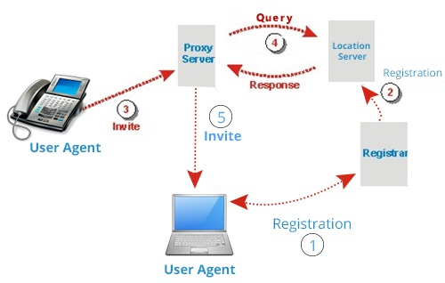
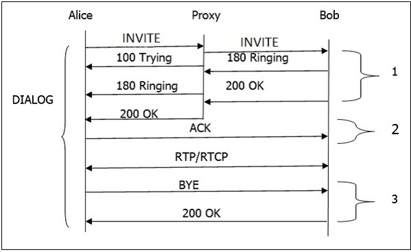

# SIP

[SIP描述](https://www.cnblogs.com/gardenofhu/p/7299963.html)

SIP是**会话建立**协议, RTP/RTCP是**远程传输**协议

`rtsp-server` 独立启动, 通过 `sip-server` 进行会话管理

## SIP 通信

SIP消息使用**MESSAGE**消息体携带**控制命令**；message消息头Content-Type头域为Content-Type: `Application/MANSCDP+xml`, 设备控制命令采用MANSCDP协议格式定义，设备在收到message消息后，应立即返回应答，应答均**无消息体**

在SIP中，每个**网元**由**SIP URI（统一资源标识符）**来标识，它像一个地址。以下是网络元素:

- 用户代理
- 代理服务器
- **注册服务器**, 接受用户代理的注册请求。它可以帮助用户在网络中进行**身份验证**
- 重定向服务器
- 位置服务器



### 用户代理

它是SIP网络的端点和**最重要**的网络元素之一。端点可以**启动，修改或终止会话**。用户代理是SIP网络中最智能的设备或网络元件。它可以是软电话，手机或笔记本电脑。

用户代理在逻辑上分为两部分:

1. 用户代理**客户端**（`UAC`） - **发送请求并接收响应**的实体。
2. 用户代理**服务器**（`UAS`） - **接收请求并发送响应**的实体。

SIP基于客户机 - 服务器架构，其中**呼叫者**的电话充当发起呼叫的**客户端**，**被叫方**的电话充当响应呼叫的**服务器**

### 代理服务器

源和目的地之间最多可以有70个代理服务器

- **无状态代理服务器** - 它只是转发收到的消息。这种类型的服务器不存储任何呼叫或交易的信息
- **有状态代理服务器** - 这种类型的代理服务器可以跟踪收到的每个请求和响应，并且如果需要，可以将来使用它。如果对方没有响应，它可以重新发送请求

### 重定向服务器

重定向服务器接收请求，并在注册服务器创建的**位置数据库**中**查找请求的预期收件人**

重定向服务器使用数据库获取位置信息，并以`3xx`（重定向响应）响应给用户

### 位置服务器

位置服务器提供有关呼叫者可能的位置到重定向和代理服务器的信息。

只有**代理服务器**或**重定向服务器**可以联系**位置服务器**

## SIP会话的基本呼叫流程



以下是对上述呼叫流程的逐步说明:

1. 发送到代理服务器的INVITE请求负责启动会话
2. 代理服务器发送100 尝试立即响应呼叫者（Alice）以停止INVITE请求的重新发送(防止重复发送invite)
3. **代理服务器**在**位置服务器**中搜索Bob的地址。获取地址后，进一步转发INVITE请求
4. 此后，Bob手机生成的180 振铃（临时响应）返回给Alice
5. Bob拿起手机后一个200 OK响应很快产生
6. 一旦200 OK到达Alice，Bob 从Alice 收到一个ACK
7. 同时，会话建立，RTP数据包（会话）从两端开始流动
8. 会话结束后，任何参与者（Alice或Bob）都可以发送一个BYE请求来终止会话。
9. BYE直接从Alice到Bob绕过代理服务器。
10. 最后，Bob发送200 OK响应来确认BYE，会话终止。

在上述基本呼叫流程中，可以使用三个事务（标记为1，2，3） 完整的呼叫（从INVITE到200 OK）称为对话**Dialog**。

## SIP 方法

核心方法:

- BYE
- REGISTER
- CANCEL
- ACK(SDP Answer)
- 200 OK(SDP Offer)
- OPTIONS

扩展方法:

- SUBSCRIBE
- NOTIFY
- PUBLISH
- REFER
- INFO
- PRACK
- MESSAGE

### exOsip2

1. eXosip_malloc
2. eXosip_init
3. eXosip_lock
4. eXosip_unlock
5. eXosip_quit
6. eXosip_execute
7. eXosip_call_terminate(callId, dialogId)
8. eXosip_call_build_initial_invite
9. eXosip_call_send_initial_invite
10. eXosip_message_build_request
    1. osip_message_set_body
    2. osip_message_set_body_mime
    3. osip_message_set_content_type
11. eXosip_message_send_request
12. eXosip_message_build_answer
13. eXosip_message_send_answer
14. eXosip_event_wait
15. eXosip_automatic_action
16. setUserAgent

### 查看 catalog

[GBT28181 SIP 设备目录查询](https://www.cnblogs.com/wilderhorse/p/3317646.html)

**UAS**(user agent server, SIP 服务器) -> **UAC**(user agent client, IPC), 服务端向客户端查看目录信息

``` xml
MESSAGE sip:34020000001320000001@3402000000 SIP/2.0  
Call-ID: 4bef8622e9d66b2b60fae6b15f4a4f63@0.0.0.0  
CSeq: 1 MESSAGE  
From: <sip:34020000002000000001@3402000000>;tag=08052615_53173353_7e47bbc7-c29c-4299-803b-71f7367975bb  
To: <sip:34020000001320000001@3402000000>  
Max-Forwards: 70  
Content-Type: Application/MANSCDP+xml  
Route: <sip:34020000001320000001@192.168.10.177:5061;line=5c2d93a668f3d3b;lr>  
Via: SIP/2.0/UDP 192.168.10.177:5060;branch=z9hG4bK7e47bbc7-c29c-4299-803b-71f7367975bb_53173353_9686809251402  
Content-Length: 125  
  
<?xml version="1.0"?>  
<Query>  
<CmdType>Catalog</CmdType>  
<SN>248</SN>  
<DeviceID>34020000001320000001</DeviceID>  
</Query>  
```

### invite

`uac`是发起方信息(包括 rtp ip/port), `uas`是接受方(服务方worker)

### CVR

CVR 标准: VP_GB28181_STD 或 VP_HUAWEI_VCN [SINCE v1.3.0].
