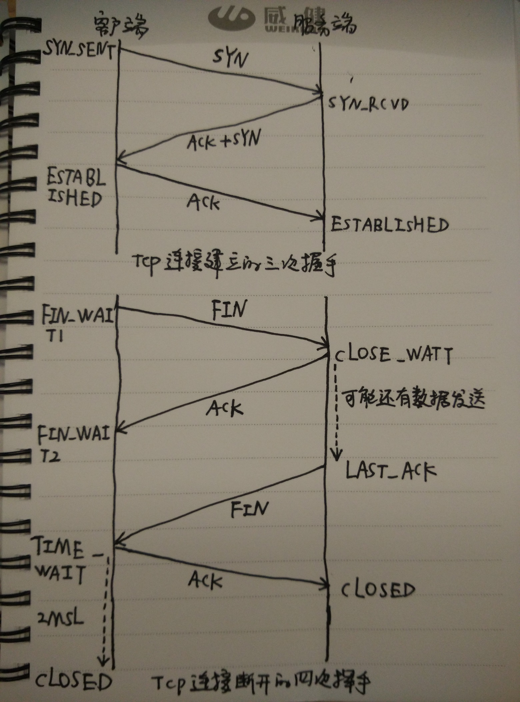

# Transport Layer

## 1. TCP/UDP

1. TCP是可靠的传输协议
2. UDP是不可靠的传输协议

## 2. TCP

### 2.1 十一中网络状态

> CLOSED, LISTEN, SYN_SENT, SYN_RCVD, ESTABLISH, FIN_WAIT1, FIN_WAIT2, CLOSING, CLOSE_WAIT, TIME_WAIT, LAST_ACK

- TIME_WAIT: 只会出现在主叫方, 解决 **网络延迟导致无效链接重连** 和 **ACK丢失重发**. TIME_WAIT 时长是 2MSL, 保证所有无效链接都能处理完成, 一次往返(比如需要 retry 的或者临时找不到目的的).
- MSL: 是任何报文在网络上存在的最长时间，超过这个时间报文将被丢弃

### 2.2 三次握手和四次挥手

1. 3次握手, 涉及 5 个状态
   1. SYN, SYN + ACK, ACK 传递一个 seq 表示顺序
      1. CLI: `CLOSED, SYNC_SENT, ESTABLISH`
      2. SRV: `CLOSED, LISTEN, SYNC_RECV, ESTABLISH`
   2. 每个 SYN 后续都要一个 ACK(Acknowledge character) 作为确认
2. 4次挥手, 涉及 6 个状态
   1. FIN, ACK, FIN, ACK
      1. CLI: `ESTABLISH, FIN_WAIT1, FIN_WAIT2, **TIME_WAIT**, CLOSED`
      2. SRV: `ESTABLISH, CLOSE_WAIT, LAST_ACK, CLOSED`
      3. `CLOSING` 状态是在 主叫方发出 FIN 后没有收到 ACK, 直接进入 CLOSING状态
   2. 如果只有 3次挥手, 会导致被叫方一直处于 LAST_ACK 状态, 而无法关闭
   3. TIME_WAIT默认是 60s, 大量短链接可能导致可创建端口被耗尽, 问题可以通过操作系统设置参数解决
      1. tcp_tw_reuse(是否允许复用) + tcp_timestamps(给每个socket标识timestamp), 时间戳标记可以解决复用socket后, 拒绝老的socket请求
      2. tcp_tw_recycle(是否允许快速销毁time_wait), todo nat和lb服务器不要开启?why

### 2.3 TCP协议下socket有可能丢包吗

[TCP 协议下 socket 有可能丢包吗？](https://www.zhihu.com/question/53960871)

> TCP 协议保证数据 **有序** 且 **连续**, 这里可能有三次握手 ack 这类的问题

TCP不关心本地send（）给自己的内容是啥（反正都是字节），只关心**时序(同步握手里有对方的ISN[Initial Sequence Number])**，先发给自己的肯定先编号，后发的后编号，**TCP本身只保证传输的顺序, 根据ISN将接到的数据按照字节排序好放入buffer**，至于在服务器端本地、客户端本地的顺序则由Receive（）/ Send（）时序来保证

不管你是一次提交100个字节还是100000个字节，**TCP保证按发送方的原始顺序把数据传输给接收方**；但并不保证按你提交时对数据的分割方式传输——你可能先收到第1个字节，然后再收到接下来的99999字节；也可能会先收到前99999字节，然后再读到最后的1个字节。

1. TCP是有缓冲区(基于`字节流`), UDP面向报文段是没有缓冲区的(基于`报文`)
2. TCP发送报文时，是将应用层数据写入TCP缓冲区中，然后由TCP协议来控制发送这里面的数据，而发送的状态是按字节流的方式发送的，跟应用层写下来的报文长度没有任何关系，所以说是流
3. UDP，它没有缓冲区，应用层写的报文数据会 **直接加包头(带有数据大小)** 交给网络层，由网络层负责分片，所以是面向报文段的
