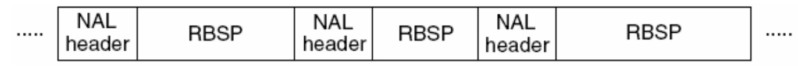
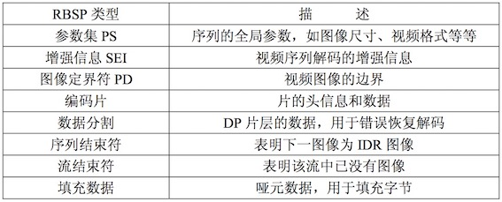

# H.264 编码

- [H.264](https://blog.csdn.net/qq_29350001/article/details/78226286)
- [从零了解H264结构](http://www.iosxxx.com/blog/2017-08-09-%E4%BB%8E%E9%9B%B6%E4%BA%86%E8%A7%A3H264%E7%BB%93%E6%9E%84.html)

## 1. NALU 语法结构

H.264原始码流(裸流)是由一个接一个NALU组成，它的功能分为两层，VCL(视频编码层)和 NAL(网络提取层):

> VCL(Video Coding Layer) + NAL(Network Abstraction Layer).

- VCL：包括**核心压缩引擎和块，宏块和片**的**语法级别定义**，设计目标是尽可能地独立于网络进行高效的编码
- NAL：负责将VCL产生的比特字符串适配到各种各样的网络和多元环境中，覆盖了所有**片级以上的语法级别**

在VCL进行数据传输或存储之前，这些编码的VCL数据，被映射或封装进NAL单元

> 一个NALU = 一组对应于视频编码的NALU头部信息 + 一个原始字节序列负荷(RBSP,Raw Byte Sequence Payload).


在H264码流中，都是以"0x00 0x00 0x01"或者"0x00 0x00 0x00 0x01"为**开始码**的 如果在編碼的過程中出現連續00 00 00時，將會在第三個00前插入一個`03`, 如果不是 03, 则確實是下一個NALU的起始碼.找到开始码之后，使用开始码之后的第一个字节的**低5位**判断是否为 7(sps)或者 8(pps), 及 data[4] & 0x1f == 7 || data[4] & 0x1f == 8。然后对获取的 **nal 去掉开始码之后进行 base64 编码**，得到的信息就可以用于 `sdp`

SPS/PPS 一般使用 4 byte startCode, 其余的 nalu 使用 3 byte startCode

每个**NALU**由一个字节的**Header**和**RBSP**组成:

- **Header** = forbidden_zero_bit(1bit) + nal_ref_idc(2bit) + nal_unit_type(5bit)
- **SODB**(String Of Data Bits)：**最原始的编码数据** RBSP, 长度不一定是8的倍数，此时需要加入 trailing 完成字节对其.
- **RBSP**： 在SODB的后面**添加**了**结尾比特**的对其数据（RBSP trailing bits）.一个 bit“1”若干bit“0”，以便字节对齐


RBSP:




码流是由一个个的NAL Unit组成的，NALU是由NALU头和RBSP数据组成，而RBSP可能是SPS，PPS，Slice或SEI，目前我们这里SEI不会出现，而且SPS位于第一个NALU，PPS位于第二个NALU，其他就是**Slice**(严谨点区分的话可以把IDR等等再分出来)了. `SPS、PPS、SEI`这三种NALU**不属于**`帧(frame)`的范畴

- SPS(Sequence Parameter Sets)：序列参数集，作用于一系列连续的编码图像, **包含了码流的属性等信息**
- PPS(Picture Parameter Set)：图像参数集，作用于编码视频序列中一个或多个独立的图像
- SEI(Supplemental enhancement information)：附加增强信息，包含了视频画面定时等信息，一般放在主编码图像数据之前，在某些应用中，它可以被省略掉
- IDR(Instantaneous Decoding Refresh)：即时解码刷新
- HRD(Hypothetical Reference Decoder)：假想码流调度器

## 2. NAL, frame, slice


``` text
1 nal ~ 1 slice
1 frame = n slice
1 slice = n MB(Macroblock)
1 MB = 16x16 yuv
```

### 2.1 片 slice

> slice = slice header + slice data

NALU不一定是切片，这是充分不必要条件，因为 NALU 还有可能装载着其他用作描述视频的信.

某片的预测不能以其他片中的宏块为参考图像，这样某一片中的预测误差才不会传播到其他片中。一个视频图像可编程一个或更多个片，每片包含整数个宏块 (MB),每片至少包含一个宏块。

### 2.2 宏块 macroblock

> 一个宏块 = 一个16*16的亮度像素 + 一个8×8Cb + 一个8×8Cr彩色像素块组成。(YCbCr 是属于 YUV 家族的一员,在YCbCr 中 Y 是指亮度分量，Cb 指蓝色色度分量，而 Cr 指红色色度分量)

frame的数据可以分为多个slice, 每个slice中的数据，在帧内预测只用到自己slice的数据， 与其他slice 数据没有依赖关系.

NAL 是用来将编码的数据进行大包的。 比如，每一个slice数据可以放在NAL 包中

- I frame 是自己独立编码，不依赖于其他frame 数据
- P frame 依赖 I frame 数据
- B frame 依赖 I frame, P frame 或其他 B frame 数据

一个frame是可以分割成多个slice来编码的，而一个slice编码之后被打包进一个NAL单元，不过NAL单元除了容纳Slice编码的码流外，还可以容纳其他数据，比如序列参数集SPS

- NAL指网络提取层，里面放一些与网络相关的信息
- slice是片的意思，264中把图像分成一帧（frame）或两场（field），而帧又可以分成一个或几个片（Slilce）；片由宏块（MB）组成。宏块是编码处理的基本单元。
- nal_unit_type 里的类型，代表接下来数据是表示啥信息的和具体如何分块
- I_slice、P_slice、B_slice 表示I类型的片、P类型的片，B类型的片.其中I_slice为帧内预测模式编码；P_slice为单向预测编码或帧内模式；B_slice 中为双向预测或帧内模式。