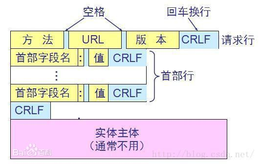
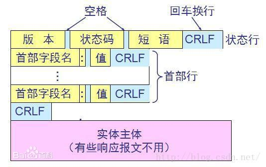

# RTP RTCP RTSP

[RTSP简介以及常用方法使用实例](https://blog.csdn.net/shining100/article/details/6030818)

## 1. RTSP

在RTSP的请求(Request)和响应(Response)中，必须包含请求和响应**序数**。该序数标识一对请求和响应。在完成一对请求和响应后，无论请求是成功还是失败，都必须将该序数**加一**。该序数在RTSP中以`CSeq`字段表示

### 1.1 流数据传输方式

[RTP/AVP & RTP/AVP/TCP](https://www.jianshu.com/p/7b9793eb2f4e)

1. **RTP/AVP/UDP** (`default`)
2. **RTP/AVP/TCP**

采用那种方式传输是由 **客户端决定**的. 在RTSP的`SETUP`命令中需要**确定**是使用`TCP`传输还是建立`UDP`传输

### 2. Request 请求



> 其中方法包括OPIONS、DESCRIBE、SETUP、PLAY、TEARDOWN等。URL是接接收方的地址，例如:rtsp://192.168.0.1/video.264。RTSP版本一般都是 RTSP/1.0。每行后面的CRLF表示回车换行，需要接收端有相应的解析，**最后一个消息头需要有两个CRLF**。消息体是可选的，有的请求消息并不带消息体

``` text
RTSP = RequestLine *([general header] | request header] | [entity header]) + CRLF + [message body]
```

**Request-Line** = **Method** SP **Request-URI** SP **RTSP-Version** CRLF

- **Method** = **OPTIONS, DESCRIBE, SETUP, PLAY, TEARDOWN**
- **SP** = 空格
- **Request-URI** = RTSP服务器的URI
- **RTSP-Version** = RTSP的版本号
- **CRLF** = 回车换行
- e.g.: `OPTIONS rtsp://192.168.10.115/live.sdp RTSP/1.0`

**general-header** = **Cache-Control** **Connection** **Date **Via**

- (VLC)的请求(**Request**)过程中一般是**忽略**的。在RTSP服务器的回应(Response)中，一般也只会出现该头的Date字段
- e.g.: `Date: Mon, 25 Oct 2010 11:0:22 GMT`

**request-header** = **Accept** **Authorization** **User-Agent**

- **Accept** = RTSP服务器在响应(Response)的时候通过什么方式说明实时流的属性。一般这个填写`application/sdp`。表示RTSP客户端希望通过会话描述协议(SDP) 来了解流的属性。
- **Authorization** = 通过BASE64或者DIGEST加密的用户名和密码。
- **User-Agent** = 代理的名称，这个值随便填写什么都可以
- e.g.: `Accept: application/sdp User-Agent:Netposa`

### 3. Response 响应



``` text
Response = Status-Line *(general-header response-header entity-header） CRLF [ message-body ]
```

**Status-Line** = **RTSP-Version** SP **Status-Code** SP **Reason-Phrase** CRLF

- **Status-Code** = 表示Request的结果。例如200表示成功，400表示失败
- **Reason-Phrase** = 回复结果的文本说明。例如成功的时候为OK
- e.g.: `RTSP/1.0 200 OK`

**response-header** = **Public** | **…**

- Public = 表示RTSP服务器所支持的方法, 这个头在实际应用的响应(Response)中一般是很少出现的。*只有在OPTIONS方法(Method)的响应中，才会出现*
- e.g.: `Public: OPTIONS, DESCRIBE, PLAY, SETUP, TEARDOWN`

**entity-header** = **Content-Base** **Content-Length** **Content-Type**

- **Content-Base** = [ message-body ]中的信息**来源**。例如rtsp://192.168.10.115/live.sdp/，表示信息来自于一个文件
- **Content-Type** = [ message-body ] 中的信息使用什么方式组织。例如application/sdp，表示使用SDP组织
- **Content-Length** = [ message-body ]的长度, 制定 body 长度
- e.g.: `Content-Base: rtsp://192.168.10.115/live.sdp/ Content-Type: application/sdp Content-Length: 431`

**message-body** = 附加信息

### 4. RTSP 方法

**OPTIONS**: RTSP客户端通过该方法(Method)**检测RTSP服务器所支持的方法**(Method)。该方法(Method)可以在任何的时候发往RTSP服务器. 同时需要在此方法完成 auth 认证.

**DESCRIBE**: 获取**RTSP服务器中指定标识(Presentation)的说明**。通过该方法，我们可以从RTSP服务器的响应(Response)中获取该标识(Presentation)下流的**名称和属性**, 以便在`SETUP`中向RTSP服务器**申请实时流**. 我们可以在该方法(Method)的Request中添加request-header的Accept字段, 来指定服务器以什么样的方式来说明流的属性

**SETUP**: 定义RTSP客户端和RTSP服务器之间**实时流的传输方式**。传输方式可以是`TCP`、`UDP`或者是`MULTICAST`其中之一。通过在SETUP发法中定义**Transport Header**的字段，可以定义RTSP客户端和RTSP服务器端使用什么方式进行流传输. 在SETUP的**RESPONSE**中，我们需要注意**记录下Session这个字段后面的值**。该值代表这次会话(Session)的`ID`，在这次会话(Session)中关于操作实时流的方法(Method)，比如`PLAY`或者`RECORD`，都需要**在请求(Request)中加入该ID**

``` go
Transport: transport-protocol/profile/lower-transport/parameter

transport-protocol = 传输协议，一般填写RTP
profile = 概述，固定填写AVP(Audio Video Profile)
lower-transport = 底层传输协议，可以填写TCP或者UDP。如果不填写，则默认使用UDP作为底层传输协议

Parameter = transport-protocol/profile[/lower-transport] ( ”unicast” | ”multicast” )
    ”;” ”interleaved” ”=” channel [ ”-” channel ]
    ”;” ”port” ”=” port [ ”-” port ]
    ”;” ”client port” ”=” port [ ”-” port ]
    ”;” ”server port” ”=” port [ ”-” port ]
    ”;” ”mode” = <”> 1#mode <”>

unicast = 单播，multicast = 多播，该参数为必填参数
interleaved = 使用传输流和RTSP控制混合传输的方式
    一般指定为一个范围:  0-1或2-3
    偶数 - 标示RTP数据
    奇数 - 标示RTCP数据
port = 多播传输时的端口
client port = UDP做为底层传输协议时的RTSP客户端的端口号
    偶数 - 用于接收RTP数据
    奇数 - 用于进行RTCP交互
server port = 使用UDP做为底层传输协议时的RTSP服务器的端口号
    偶数 - 用于发送RTP数据
    奇数 - 用于进行RTCP交互
mode = 即将进行的取流操作。可以填写PLAY或者RECORD

C->S: SETUP rtsp://example.com/foo/bar/baz.rm RTSP/1.0
CSeq: 302
Transport: RTP/AVP;unicast;interleaved=0-1;client_port=4588-4589

S->C: RTSP/1.0 200 OK
CSeq: 302
Date: 23 Jan 1997 15:35:06 GMT
Session: 47112344
Transport: RTP/AVP;unicast;interleaved=0-1;client_port=4588-4589;server_port=6256-6257
```

**PLAY**: 请求RTSP服务器以在SETUP约定的方式发送流

**TEARDOWN**: 终止会话

在使用PLAY方法并得到成功的Response后，RTSP服务器就会向RTSP客户端发送实时流数据了。发送过来的数据的**第一个字节**是一个**ASCII码**`$`，**第二个字节**是在`SETUP`里面interleaved定义的**Channel(通道)号**，**第3,4个字节**是**RTP/RTCP包的大小**，注意该大小是按照**网络字节序**表示的。最后跟着的就是`RTP/RTCP`**包**了。示例如下：

``` text
S->C: $/000{2 byte length}{"length" bytes data, w/RTP header}
S->C: $/000{2 byte length}{"length" bytes data, w/RTP header}
S->C: $/001{2 byte length}{"length" bytes RTCP packet}
```
